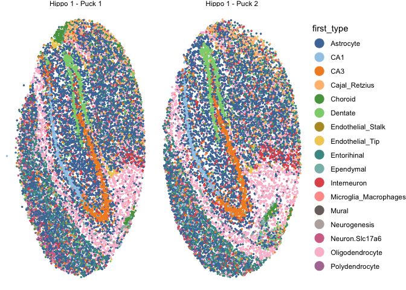
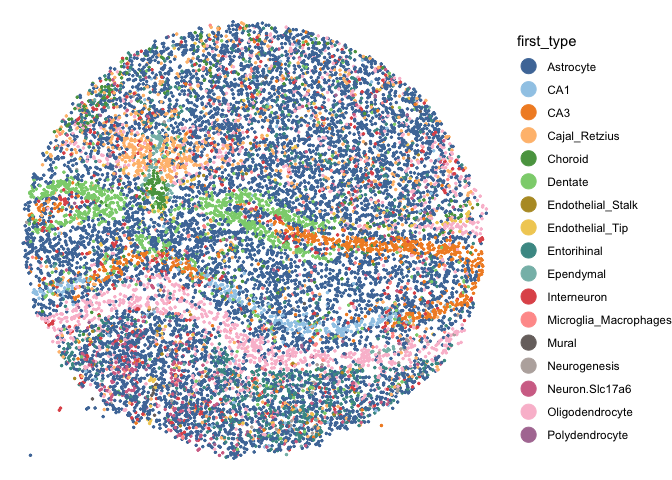
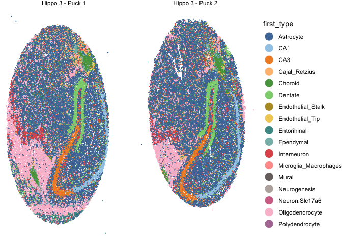
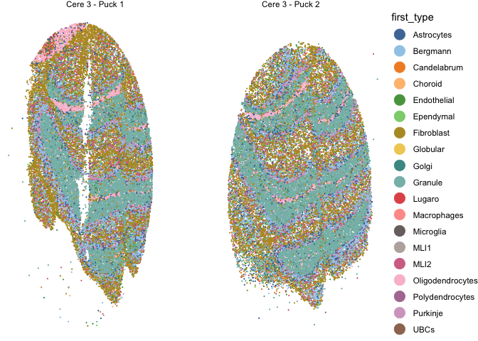
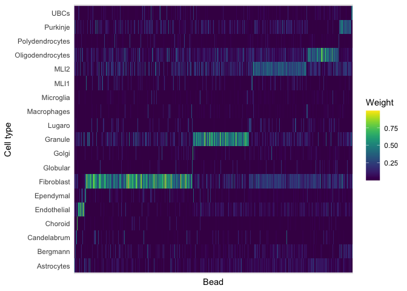
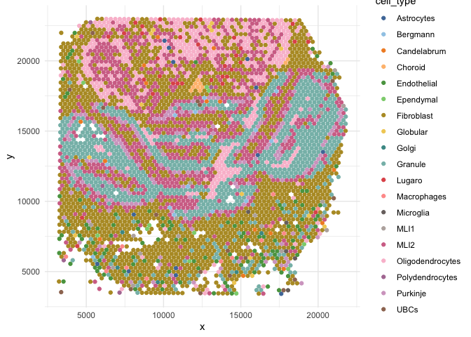
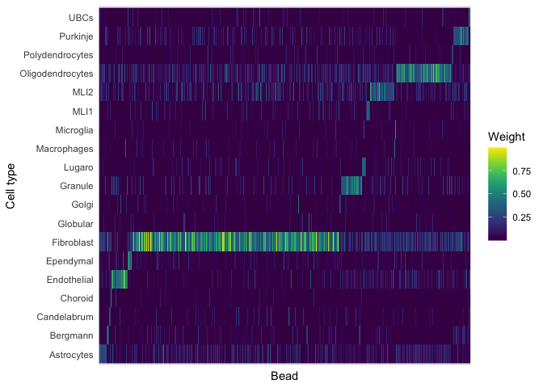
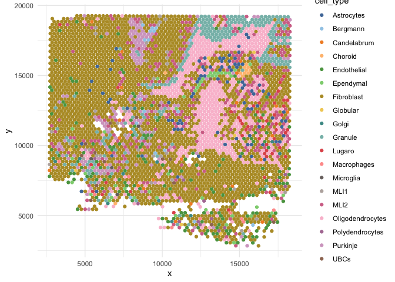

Cell type maps
================

- <a href="#slide-seq" id="toc-slide-seq">Slide-seq</a>
  - <a href="#hippocampus-1" id="toc-hippocampus-1">Hippocampus 1</a>
  - <a href="#hippocampus-2" id="toc-hippocampus-2">Hippocampus 2</a>
  - <a href="#hippocampus-3" id="toc-hippocampus-3">Hippocampus 3</a>
  - <a href="#cerebellum-3" id="toc-cerebellum-3">Cerebellum 3</a>
- <a href="#visium" id="toc-visium">Visium</a>
  - <a href="#cerebellum-4" id="toc-cerebellum-4">Cerebellum 4</a>
  - <a href="#mixture" id="toc-mixture">Mixture</a>

``` r
library(spacexr)
library(spASE)
```

    Registered S3 method overwritten by 'spASE':
      method             from   
      merge.RCTD.objects spacexr


    Attaching package: 'spASE'

    The following objects are masked from 'package:spacexr':

        aggregate_cell_types, build.designmatrix.intercept,
        build.designmatrix.nonparam, build.designmatrix.regions,
        build.designmatrix.single, choose_sigma_c, convert.old.RCTD,
        count_cell_types, create_RCTD_plots, create.RCTD,
        create.RCTD.replicates, CSIDE.population.inference,
        exvar.celltocell.interactions, exvar.point.density, fitBulk,
        fitPixels, get_cell_type_info, get_de_genes, get_doublet_weights,
        get_norm_ref, get_standard_errors, import_weights,
        make_all_de_plots, make_de_plots_genes, make_de_plots_quant,
        make_de_plots_regions, make_de_plots_replicates,
        make_de_plots_spatial, normalize_weights, plot_all_cell_types,
        plot_class, plot_cond_occur, plot_doub_occur_stack, plot_doublets,
        plot_doublets_type, plot_gene_raw, plot_gene_regions,
        plot_gene_two_regions, plot_occur_unthreshold,
        plot_prediction_gene, plot_puck_continuous, plot_puck_wrapper,
        plot_weights, plot_weights_doublet, plot_weights_unthreshold,
        process_beads_batch, process_data, read.SpatialRNA,
        read.VisiumSpatialRNA, Reference, restrict_counts, restrict_puck,
        run.CSIDE, run.CSIDE.general, run.CSIDE.intercept,
        run.CSIDE.nonparam, run.CSIDE.regions, run.CSIDE.replicates,
        run.CSIDE.single, run.RCTD, run.RCTD.replicates,
        save.CSIDE.replicates, set_cell_types_assigned,
        set_likelihood_vars, SpatialRNA, write_de_summary

``` r
library(dplyr)
```


    Attaching package: 'dplyr'

    The following objects are masked from 'package:stats':

        filter, lag

    The following objects are masked from 'package:base':

        intersect, setdiff, setequal, union

``` r
library(tidyr)
library(ggplot2)
library(reshape2)
```


    Attaching package: 'reshape2'

    The following object is masked from 'package:tidyr':

        smiths

``` r
library(viridis)
```

    Loading required package: viridisLite

``` r
library(pals)
```


    Attaching package: 'pals'

    The following objects are masked from 'package:viridis':

        cividis, inferno, magma, plasma, turbo, viridis

    The following objects are masked from 'package:viridisLite':

        cividis, inferno, magma, plasma, turbo, viridis

``` r
library(rtracklayer)
```

    Loading required package: GenomicRanges

    Loading required package: stats4

    Loading required package: BiocGenerics


    Attaching package: 'BiocGenerics'

    The following objects are masked from 'package:dplyr':

        combine, intersect, setdiff, union

    The following objects are masked from 'package:stats':

        IQR, mad, sd, var, xtabs

    The following objects are masked from 'package:base':

        anyDuplicated, aperm, append, as.data.frame, basename, cbind,
        colnames, dirname, do.call, duplicated, eval, evalq, Filter, Find,
        get, grep, grepl, intersect, is.unsorted, lapply, Map, mapply,
        match, mget, order, paste, pmax, pmax.int, pmin, pmin.int,
        Position, rank, rbind, Reduce, rownames, sapply, setdiff, sort,
        table, tapply, union, unique, unsplit, which.max, which.min

    Loading required package: S4Vectors


    Attaching package: 'S4Vectors'

    The following object is masked from 'package:tidyr':

        expand

    The following objects are masked from 'package:dplyr':

        first, rename

    The following object is masked from 'package:utils':

        findMatches

    The following objects are masked from 'package:base':

        expand.grid, I, unname

    Loading required package: IRanges


    Attaching package: 'IRanges'

    The following objects are masked from 'package:dplyr':

        collapse, desc, slice

    Loading required package: GenomeInfoDb

``` r
library(ggrepel)
library(ggthemes)
library(tibble)

gencode <- import('results/gencode.vM10.annotation.gff3.gz')
xchr_genes <- unique(gencode$gene_name[which(seqnames(gencode)=='chrX')])
```

# Slide-seq

## Hippocampus 1

``` r
hippo_slide <- readRDS('results/rctd_hippo_1.rds')
```

``` r
hippo_slide@spatialRNA@coords |>
  rownames_to_column('barcode') |>
  mutate(puck = ifelse(grepl('_1', barcode), 'Hippo 1 - Puck 1', 'Hippo 1 - Puck 2')) |>
  bind_cols(hippo_slide@results$results_df) |>
  ggplot(aes(x = x, y = y)) +
  geom_point(aes(color = first_type),size=0.5) +
  scale_color_tableau(palette = 'Tableau 20') +
  facet_wrap(puck ~ ., scales='free') +
  guides(color = guide_legend(override.aes = list(size=5))) +
  theme_void()
```



``` r
ggsave('figures/01_eda_slideseq_hippo_1_celltype.png', height=5, width=11)
```

## Hippocampus 2

``` r
hippo_slide <- readRDS('results/rctd_hippo_2.rds')
```

``` r
hippo_slide@spatialRNA@coords |>
  bind_cols(hippo_slide@results$results_df) |>
  ggplot(aes(x = y, y = x)) +
  geom_point(aes(color = first_type),size=0.5) +
  scale_color_tableau(palette = 'Tableau 20') +
  guides(color = guide_legend(override.aes = list(size=5))) +
  theme_void()
```



``` r
ggsave('figures/01_eda_slideseq_hippo_2_celltype.png', height=4, width=6)
```

## Hippocampus 3

``` r
hippo_slide <- readRDS('results/rctd_hippo_3.rds')
```

``` r
hippo_slide@spatialRNA@coords |>
  rownames_to_column('barcode') |>
  mutate(puck = ifelse(grepl('_1', barcode), 'Hippo 3 - Puck 1', 'Hippo 3 - Puck 2')) |>
  bind_cols(hippo_slide@results$results_df) |>
  ggplot(aes(x = y, y = x)) +
  geom_point(aes(color = first_type),size=0.01) +
  scale_color_tableau(palette = 'Tableau 20') +
  facet_wrap(puck ~ .) +
  guides(color = guide_legend(override.aes = list(size=5))) +
  theme_void()
```



``` r
ggsave('figures/01_eda_slideseq_hippo_3_celltype.png', height=5, width=11)
```

## Cerebellum 3

``` r
cere_slide <- readRDS('results/rctd_cere_3.rds')
```

``` r
cere_slide@spatialRNA@coords |>
  rownames_to_column('barcode') |>
  mutate(puck = ifelse(grepl('_1', barcode), 'Cere 3 - Puck 1', 'Cere 3 - Puck 2')) |>
  bind_cols(cere_slide@results$results_df) |>
  ggplot(aes(x = x, y = y)) +
  geom_point(aes(color = first_type),size=0.01) +
  scale_color_tableau(palette = 'Tableau 20') +
  facet_wrap(puck ~ .) +
  guides(color = guide_legend(override.aes = list(size=5))) +
  theme_void()
```



``` r
ggsave('figures/01_eda_slideseq_cere_3_celltype.png', height=5, width=11)
```

# Visium

## Cerebellum 4

``` r
cere_vis <- readRDS('results/rctd_cere_4_visium.rds')
results <- cere_vis@results
# normalize the cell type proportions to sum to 1.
norm_weights <- normalize_weights(results$weights) 
cell_type_names <- cere_vis@cell_type_info$info[[2]] #list of cell type names
labels <- cell_type_names[max.col(norm_weights, 'first')]
```

#### Show weight matrix

``` r
label_df <- data.frame(bead = rownames(cere_vis@spatialRNA@coords), label = labels)
df <- as.matrix(norm_weights) |>
  reshape2::melt() |>
  dplyr::rename(bead = Var1, celltype = Var2) |>
  left_join(label_df, by='bead') |>
  arrange(label)
df$bead <- factor(df$bead, levels = unique(df$bead))
df |>
  ggplot(aes(x = bead, y = celltype, fill = value)) +
  geom_raster() +
  scale_fill_viridis(name = 'Weight') +
  theme_minimal() +
  theme(axis.text.x = element_blank()) +
  ylab('Cell type') +
  xlab('Bead')
```



``` r
ggsave('figures/01_eda_visium_cerebellum_celltype_weights.png', height=3, width=5)
```

#### Cell type map

``` r
cere_vis@spatialRNA@coords |>
  mutate(cell_type = labels) |>
  ggplot(aes(x = x, y = y)) +
  geom_point(aes(color = cell_type)) +
  scale_color_tableau(palette = 'Tableau 20') +
  theme_minimal()
```



``` r
ggsave('figures/01_eda_visium_cerebellum_celltype_map.pdf', height=5, width=7)
```

## Mixture

``` r
mix_vis <- readRDS('results/rctd_mix_5_visium.rds')
results <- mix_vis@results
# normalize the cell type proportions to sum to 1.
norm_weights <- normalize_weights(results$weights) 
cell_type_names <- mix_vis@cell_type_info$info[[2]] #list of cell type names
labels <- cell_type_names[max.col(norm_weights, 'first')]
```

#### Show weight matrix

``` r
label_df <- data.frame(bead = rownames(mix_vis@spatialRNA@coords), label = labels)
df <- as.matrix(norm_weights) |>
  reshape2::melt() |>
  dplyr::rename(bead = Var1, celltype = Var2) |>
  left_join(label_df, by='bead') |>
  arrange(label)
df$bead <- factor(df$bead, levels = unique(df$bead))
df |>
  ggplot(aes(x = bead, y = celltype, fill = value)) +
  geom_raster() +
  scale_fill_viridis(name = 'Weight') +
  theme_minimal() +
  theme(axis.text.x = element_blank()) +
  ylab('Cell type') +
  xlab('Bead')
```



``` r
ggsave('figures/01_eda_visium_mixture_celltype_weights.png', height=3, width=5)
```

#### Cell type map

``` r
mix_vis@spatialRNA@coords |>
  mutate(cell_type = labels) |>
  ggplot(aes(x = x, y = y)) +
  geom_point(aes(color = cell_type)) +
  scale_color_tableau(palette = 'Tableau 20') +
  theme_minimal()
```



``` r
ggsave('figures/01_eda_visium_mixture_celltype_map.pdf', height=5, width=7)
```
