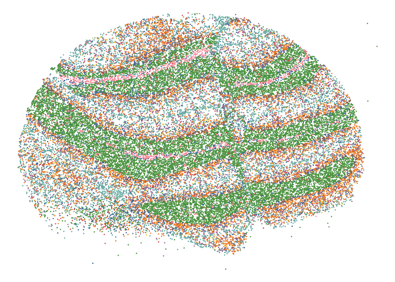
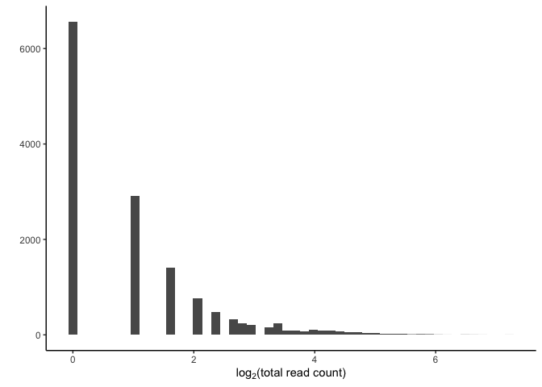
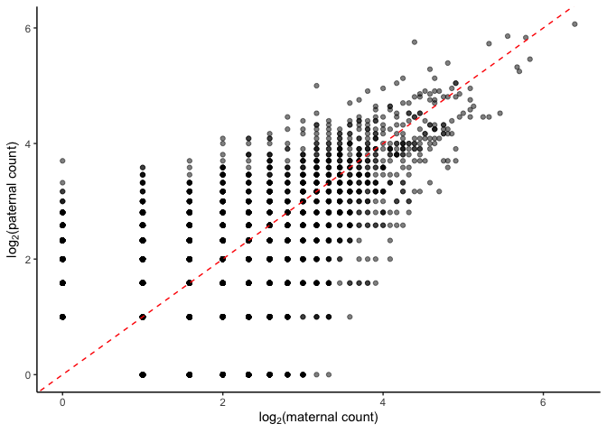

Comparing Visium and Slide-seq
================

- <a href="#summary-of-reads" id="toc-summary-of-reads">Summary of
  reads</a>
  - <a href="#slide-seq" id="toc-slide-seq">Slide-seq</a>
    - <a href="#per-gene" id="toc-per-gene">Per gene</a>
  - <a href="#visium" id="toc-visium">Visium</a>
    - <a href="#per-gene-1" id="toc-per-gene-1">Per gene</a>
- <a href="#cell-types-less" id="toc-cell-types-less">Cell types
  (less)</a>
  - <a href="#visium-1" id="toc-visium-1">Visium</a>
  - <a href="#slide-seq-1" id="toc-slide-seq-1">Slide-seq</a>
- <a href="#aldoc" id="toc-aldoc">Aldoc</a>
  - <a href="#raw-slideseq" id="toc-raw-slideseq">Raw slideseq</a>
  - <a href="#raw-visium" id="toc-raw-visium">Raw Visium</a>

``` r
library(dplyr)
```


    Attaching package: 'dplyr'

    The following objects are masked from 'package:stats':

        filter, lag

    The following objects are masked from 'package:base':

        intersect, setdiff, setequal, union

``` r
library(tidyr)
library(ggplot2)
library(xtable)
library(latex2exp)
library(rtracklayer)
```

    Loading required package: GenomicRanges

    Loading required package: stats4

    Loading required package: BiocGenerics


    Attaching package: 'BiocGenerics'

    The following objects are masked from 'package:dplyr':

        combine, intersect, setdiff, union

    The following objects are masked from 'package:stats':

        IQR, mad, sd, var, xtabs

    The following objects are masked from 'package:base':

        anyDuplicated, aperm, append, as.data.frame, basename, cbind,
        colnames, dirname, do.call, duplicated, eval, evalq, Filter, Find,
        get, grep, grepl, intersect, is.unsorted, lapply, Map, mapply,
        match, mget, order, paste, pmax, pmax.int, pmin, pmin.int,
        Position, rank, rbind, Reduce, rownames, sapply, setdiff, sort,
        table, tapply, union, unique, unsplit, which.max, which.min

    Loading required package: S4Vectors


    Attaching package: 'S4Vectors'

    The following object is masked from 'package:tidyr':

        expand

    The following objects are masked from 'package:dplyr':

        first, rename

    The following object is masked from 'package:utils':

        findMatches

    The following objects are masked from 'package:base':

        expand.grid, I, unname

    Loading required package: IRanges


    Attaching package: 'IRanges'

    The following objects are masked from 'package:dplyr':

        collapse, desc, slice

    Loading required package: GenomeInfoDb

``` r
library(ggthemes)
library(tibble)

gencode <- import('results/gencode.vM10.annotation.gff3.gz')
xchr_genes <- unique(gencode$gene_name[which(seqnames(gencode)=='chrX')])
```

``` r
visium <- readRDS('results/rctd_cere_4_visium.rds')
slideseq <- readRDS('results/rctd_cere_3.rds')
```

# Summary of reads

## Slide-seq

``` r
maternal_counts <- as.data.frame(summary(slideseq@originalSpatialRNA@maternalCounts))
maternal_counts$gene <- rownames(slideseq@originalSpatialRNA@maternalCounts)[maternal_counts$i]
maternal_counts$bead <- colnames(slideseq@originalSpatialRNA@maternalCounts)[maternal_counts$j]
maternal_counts$CAST <- maternal_counts$x
maternal_counts <- maternal_counts[,c('gene','bead','CAST')]

paternal_counts <- as.data.frame(summary(slideseq@originalSpatialRNA@paternalCounts))
paternal_counts$gene <- rownames(slideseq@originalSpatialRNA@paternalCounts)[paternal_counts$i]
paternal_counts$bead <- colnames(slideseq@originalSpatialRNA@paternalCounts)[paternal_counts$j]
paternal_counts$`129` <- paternal_counts$x
paternal_counts <- paternal_counts[,c('gene','bead','129')]

slideseq_counts <- left_join(maternal_counts, paternal_counts)
```

    Joining with `by = join_by(gene, bead)`

### Per gene

``` r
slideseq_counts |>
  group_by(gene) |>
  summarise(CAST = sum(CAST), `129` = sum(`129`)) |>
  ggplot(aes(x = log2(CAST+1), y = log2(`129`+1))) +
  geom_point(alpha=0.25) +
  theme_minimal() +
  theme(panel.grid.major = element_blank(), panel.grid.minor = element_blank(), axis.line = element_line(colour = "black")) +
  geom_abline(slope=1, intercept=0, lty='dashed', color='red') +
  xlab('log2(maternal+1)') +
  ylab('log2(paternal+1)') +
  ggtitle('Slide-seq')
```


``` r
ggsave('figures/02_slideseq_counts_scatter_per_gene.png', height=3, width =3)
```

## Visium

``` r
maternal_counts <- as.data.frame(summary(visium@originalSpatialRNA@maternalCounts))
maternal_counts$gene <- rownames(visium@originalSpatialRNA@maternalCounts)[maternal_counts$i]
maternal_counts$bead <- colnames(visium@originalSpatialRNA@maternalCounts)[maternal_counts$j]
maternal_counts$CAST <- maternal_counts$x
maternal_counts <- maternal_counts[,c('gene','bead','CAST')]

paternal_counts <- as.data.frame(summary(visium@originalSpatialRNA@paternalCounts))
paternal_counts$gene <- rownames(visium@originalSpatialRNA@paternalCounts)[paternal_counts$i]
paternal_counts$bead <- colnames(visium@originalSpatialRNA@paternalCounts)[paternal_counts$j]
paternal_counts$`129` <- paternal_counts$x
paternal_counts <- paternal_counts[,c('gene','bead','129')]

visium_counts <- left_join(maternal_counts, paternal_counts)
```

    Joining with `by = join_by(gene, bead)`

### Per gene

``` r
visium_counts |>
  group_by(gene) |>
  summarise(CAST = sum(CAST), `129` = sum(`129`)) |>
  ggplot(aes(x = log2(CAST+1), y = log2(`129`+1))) +
  geom_point(alpha=0.25) +
  theme_minimal() +
  theme(panel.grid.major = element_blank(), panel.grid.minor = element_blank(), axis.line = element_line(colour = "black")) +
  geom_abline(slope=1, intercept=0, lty='dashed', color='red') +
  xlab('log2(maternal+1)') +
  ylab('log2(paternal+1)') +
  ggtitle('Visium') +
  coord_cartesian(ylim=c(0,17),xlim=c(0,17)) 
```


``` r
ggsave('figures/02_visium_counts_scatter_per_gene.png', height=3, width =3)
```

# Cell types (less)

## Visium

``` r
results <- visium@results
# normalize the cell type proportions to sum to 1.
norm_weights <- spASE:::normalize_weights(results$weights) 
cell_type_names <- visium@cell_type_info$info[[2]] #list of cell type names
labels <- cell_type_names[max.col(norm_weights, 'first')]
main_types <- c('Astrocytes', 'Bergmann', 'Endothelial', 'Fibroblast', 'Granule', 'MLI1', 'MLI2', 'Oligodendrocytes','Purkinje')
visium@spatialRNA@coords |>
  mutate(cell_type = labels) |>
  filter(cell_type %in% main_types) |>
  filter(y > 7500) |>
  ggplot(aes(x = x, y = y)) +
  geom_point(aes(color = cell_type),size=0.75) +
  scale_color_tableau(name = 'First type', palette = 'Tableau 10') +
  theme_void()
```


``` r
ggsave('figures/02_visium_cerebellum_celltypes_less.pdf', height=3, width=5)
```

## Slide-seq

``` r
slideseq@spatialRNA@coords |>
  rownames_to_column('barcode') |>
  bind_cols(slideseq@results$results_df) |>
  filter(grepl('_2', barcode)) |>
  filter(first_type %in% main_types) |>
  ggplot(aes(x = x, y = y)) +
  geom_point(aes(color = first_type),size=0.01) +
  scale_color_tableau(name = 'First type', palette = 'Tableau 10') +
  theme_void() +
  theme(legend.position='none')
```



``` r
ggsave('figures/02_slideseq_cerebellum_one_slice_celltypes_less.pdf', height=3, width=4)
```

# Aldoc

## Raw slideseq

``` r
Aldoc <- slideseq_counts |> filter(gene == 'Aldoc', grepl('_2', bead)) |> mutate(total = CAST + `129`) |> filter(total>0)
Aldoc <- left_join(Aldoc, slideseq@spatialRNA@coords |> rownames_to_column('bead'), by = 'bead') |> left_join((slideseq@results$results_df |> rownames_to_column('bead')))
```

    Joining with `by = join_by(bead)`

``` r
Aldoc |>
  filter(x > 1000, y > 1000, x < 5400) |>
  ggplot(aes(x = log2(total))) +
  geom_histogram(bins=50) +
  xlab(TeX(r'($\log_2$(total read count))')) +
  ylab('')+
  theme_classic()
```



``` r
ggsave('figures/02_Aldoc_raw_slideseq_hist.pdf', height=1, width=4)
```

``` r
Aldoc |>
  filter(x > 1000, y > 1000, x < 5400) |>
  ggplot(aes(x = log2(CAST+1), y = log2(`129`+1))) +
  geom_point(alpha=0.5) +
  geom_abline(intercept=0, slope=1, lty='dashed', color='red') +
  theme_classic() +
  xlab(TeX(r'($\log_2$(maternal count))')) +
  ylab(TeX(r'($\log_2$(paternal count))'))
```



``` r
ggsave('figures/02_Aldoc_raw_slideseq_bead_count.pdf', height=3, width=4)
```

``` r
Aldoc |>
  filter(x > 1000, y > 1000, x < 5400) |>
  ggplot(aes(x = x, y = y)) +
  geom_point(aes(color = CAST/total),size=0.5) +
  scale_color_gradient2(low='blue',mid='white',high='red',midpoint=0.5,limits=c(0,1)) +
  theme_void()  +
  theme(legend.position = 'none')
```


``` r
ggsave('figures/02_Aldoc_raw_slideseq.pdf', height=3, width=4)
```

## Raw Visium

``` r
Aldoc <- visium_counts |> filter(gene == 'Aldoc') |> mutate(total = CAST + `129`) |> filter(total>0)
Aldoc <- left_join(Aldoc, visium@spatialRNA@coords |> rownames_to_column('bead'), by = 'bead') 
```

``` r
Aldoc |>
  filter(y > 7500) |>
  ggplot(aes(x = log2(total))) +
  geom_histogram(bins=50) +
  theme_classic() +
  xlab(TeX(r'($\log_2$(total read count))')) +
  ylab('')
```


``` r
ggsave('figures/02_Aldoc_raw_visium_hist.pdf', height=1, width=4)
```

``` r
Aldoc |>
  filter(y > 7500) |>
  ggplot(aes(x = log2(CAST+1), y = log2(`129`+1))) +
  geom_point(alpha=0.5) +
  geom_abline(intercept=0, slope=1, lty='dashed', color='red') +
  theme_classic() +
  xlab(TeX(r'($\log_2$(maternal count))')) +
  ylab(TeX(r'($\log_2$(paternal count))'))
```


``` r
ggsave('figures/02_Aldoc_raw_visium_bead_count.pdf', height=3, width=4)
```

``` r
Aldoc |>
  filter(y > 7500) |>
  ggplot(aes(x = x, y = y)) +
  geom_point(aes(fill = CAST/total),shape=21) +
  scale_fill_gradient2(name = 'Maternal\nread\nproportion',low='blue',mid='white',high='red',midpoint=0.5,limits=c(0,1)) +
  theme_void() 
```


``` r
ggsave('figures/02_Aldoc_raw_visium.pdf', height=3, width=6)
```
