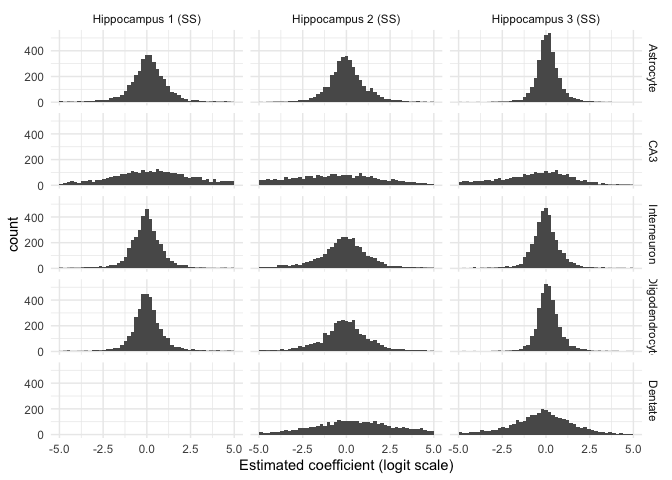
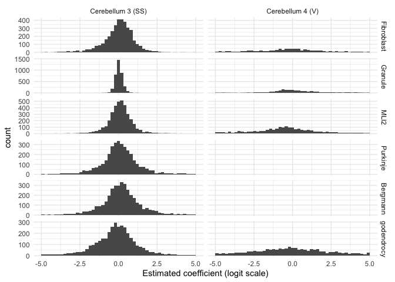
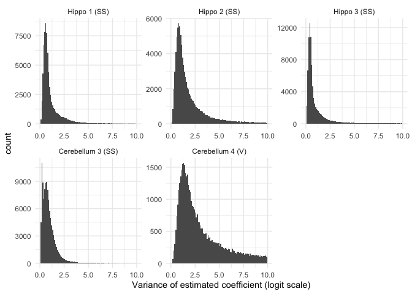

Simulations
================

- <a href="#load-in-data" id="toc-load-in-data">Load in data</a>
- <a href="#histograms-of-cside-mean-estimates"
  id="toc-histograms-of-cside-mean-estimates">Histograms of CSIDE mean
  estimates</a>
  - <a href="#ex-for-schematic" id="toc-ex-for-schematic">Ex for
    schematic</a>
    - <a href="#compute-alphas" id="toc-compute-alphas">Compute alphas</a>
    - <a href="#generate-bases-and-random-smooth-for-a-cell-type"
      id="toc-generate-bases-and-random-smooth-for-a-cell-type">Generate bases
      and random smooth for a cell type</a>
- <a href="#simulations" id="toc-simulations">Simulations</a>
  - <a href="#visium-cerebellum" id="toc-visium-cerebellum">Visium
    cerebellum</a>
  - <a href="#slide-seq-cerebellum" id="toc-slide-seq-cerebellum">Slide-seq
    cerebellum</a>
- <a href="#plot-simulation-results" id="toc-plot-simulation-results">Plot
  simulation results</a>

``` r
library(Matrix)
library(spacexr)
library(spASE)
```

    Registered S3 method overwritten by 'spASE':
      method             from   
      merge.RCTD.objects spacexr


    Attaching package: 'spASE'

    The following objects are masked from 'package:spacexr':

        aggregate_cell_types, build.designmatrix.intercept,
        build.designmatrix.nonparam, build.designmatrix.regions,
        build.designmatrix.single, choose_sigma_c, convert.old.RCTD,
        count_cell_types, create_RCTD_plots, create.RCTD,
        create.RCTD.replicates, CSIDE.population.inference,
        exvar.celltocell.interactions, exvar.point.density, fitBulk,
        fitPixels, get_cell_type_info, get_de_genes, get_doublet_weights,
        get_norm_ref, get_standard_errors, import_weights,
        make_all_de_plots, make_de_plots_genes, make_de_plots_quant,
        make_de_plots_regions, make_de_plots_replicates,
        make_de_plots_spatial, normalize_weights, plot_all_cell_types,
        plot_class, plot_cond_occur, plot_doub_occur_stack, plot_doublets,
        plot_doublets_type, plot_gene_raw, plot_gene_regions,
        plot_gene_two_regions, plot_occur_unthreshold,
        plot_prediction_gene, plot_puck_continuous, plot_puck_wrapper,
        plot_weights, plot_weights_doublet, plot_weights_unthreshold,
        process_beads_batch, process_data, read.SpatialRNA,
        read.VisiumSpatialRNA, Reference, restrict_counts, restrict_puck,
        run.CSIDE, run.CSIDE.general, run.CSIDE.intercept,
        run.CSIDE.nonparam, run.CSIDE.regions, run.CSIDE.replicates,
        run.CSIDE.single, run.RCTD, run.RCTD.replicates,
        save.CSIDE.replicates, set_cell_types_assigned,
        set_likelihood_vars, SpatialRNA, write_de_summary

``` r
library(ggplot2)
library(dplyr)
```


    Attaching package: 'dplyr'

    The following objects are masked from 'package:stats':

        filter, lag

    The following objects are masked from 'package:base':

        intersect, setdiff, setequal, union

``` r
library(tidyr)
```


    Attaching package: 'tidyr'

    The following objects are masked from 'package:Matrix':

        expand, pack, unpack

``` r
library(Rfast)
```

    Loading required package: Rcpp

    Loading required package: RcppZiggurat


    Attaching package: 'Rfast'

    The following object is masked from 'package:dplyr':

        nth

``` r
library(data.table)
```


    Attaching package: 'data.table'

    The following object is masked from 'package:Rfast':

        transpose

    The following objects are masked from 'package:dplyr':

        between, first, last

``` r
library(ggthemes)
library(latex2exp)
library(wesanderson)

source('../R/spase_sim_utils.R')
```

# Load in data

``` r
cere3 <- readRDS('results/results_celltype_cere_3_df_5.rds')
cere4 <- readRDS('results/results_celltype_cere_4_visium_df_5.rds')
hippo1 <- readRDS('results/results_celltype_hippo_1_df_5.rds')
hippo2 <- readRDS('results/results_celltype_hippo_2_df_5.rds')
hippo3 <- readRDS('results/results_celltype_hippo_3_df_5.rds')
```

# Histograms of CSIDE mean estimates

``` r
hippo1@de_results$gene_fits$mean_val |>
  melt() |>
  mutate(sample = 'Hippocampus 1 (SS)') |>
  bind_rows(hippo2@de_results$gene_fits$mean_val |>
              melt() |>
              mutate(sample = 'Hippocampus 2 (SS)')) |>
  bind_rows(hippo3@de_results$gene_fits$mean_val |>
              melt() |>
              mutate(sample = 'Hippocampus 3 (SS)')) |>
  ggplot(aes(x = value)) +
  geom_histogram(bins=50) +
  facet_grid(Var2 ~ sample) +
  theme_minimal() + 
  xlim(c(-5,5)) +
  xlab('Estimated coefficient (logit scale)') 
```

    Warning in melt(hippo1@de_results$gene_fits$mean_val): The melt generic in
    data.table has been passed a matrix and will attempt to redirect to the
    relevant reshape2 method; please note that reshape2 is deprecated, and this
    redirection is now deprecated as well. To continue using melt methods from
    reshape2 while both libraries are attached, e.g. melt.list, you can prepend the
    namespace like reshape2::melt(hippo1@de_results$gene_fits$mean_val). In the
    next version, this warning will become an error.

    Warning in melt(hippo2@de_results$gene_fits$mean_val): The melt generic in
    data.table has been passed a matrix and will attempt to redirect to the
    relevant reshape2 method; please note that reshape2 is deprecated, and this
    redirection is now deprecated as well. To continue using melt methods from
    reshape2 while both libraries are attached, e.g. melt.list, you can prepend the
    namespace like reshape2::melt(hippo2@de_results$gene_fits$mean_val). In the
    next version, this warning will become an error.

    Warning in melt(hippo3@de_results$gene_fits$mean_val): The melt generic in
    data.table has been passed a matrix and will attempt to redirect to the
    relevant reshape2 method; please note that reshape2 is deprecated, and this
    redirection is now deprecated as well. To continue using melt methods from
    reshape2 while both libraries are attached, e.g. melt.list, you can prepend the
    namespace like reshape2::melt(hippo3@de_results$gene_fits$mean_val). In the
    next version, this warning will become an error.

    Warning: Removed 4571 rows containing non-finite values (`stat_bin()`).



``` r
ggsave('figures/03_cside_estimates_hippo.pdf', height=6, width=5)
```

    Warning: Removed 4571 rows containing non-finite values (`stat_bin()`).

``` r
cere3@de_results$gene_fits$mean_val |>
  melt() |>
  mutate(sample = 'Cerebellum 3 (SS)') |>
  bind_rows(cere4@de_results$gene_fits$mean_val |>
              melt() |>
              mutate(sample = 'Cerebellum 4 (V)')) |>
  ggplot(aes(x = value)) +
  geom_histogram(bins=50) +
  facet_grid(Var2 ~ sample, scales='free') +
  theme_minimal() + 
  xlim(c(-5,5)) +
  xlab('Estimated coefficient (logit scale)') 
```

    Warning in melt(cere3@de_results$gene_fits$mean_val): The melt generic in
    data.table has been passed a matrix and will attempt to redirect to the
    relevant reshape2 method; please note that reshape2 is deprecated, and this
    redirection is now deprecated as well. To continue using melt methods from
    reshape2 while both libraries are attached, e.g. melt.list, you can prepend the
    namespace like reshape2::melt(cere3@de_results$gene_fits$mean_val). In the next
    version, this warning will become an error.

    Warning in melt(cere4@de_results$gene_fits$mean_val): The melt generic in
    data.table has been passed a matrix and will attempt to redirect to the
    relevant reshape2 method; please note that reshape2 is deprecated, and this
    redirection is now deprecated as well. To continue using melt methods from
    reshape2 while both libraries are attached, e.g. melt.list, you can prepend the
    namespace like reshape2::melt(cere4@de_results$gene_fits$mean_val). In the next
    version, this warning will become an error.

    Warning: Removed 7200 rows containing non-finite values (`stat_bin()`).



``` r
ggsave('figures/03_cside_estimates_cere.pdf', height=6, width=3)
```

    Warning: Removed 7200 rows containing non-finite values (`stat_bin()`).

``` r
hippo1@de_results$gene_fits$s_mat |>
  melt() |>
  mutate(sample = 'Hippo 1 (SS)') |>
  bind_rows(hippo2@de_results$gene_fits$s_mat |>
              melt() |>
              mutate(sample = 'Hippo 2 (SS)')) |>
  bind_rows(hippo3@de_results$gene_fits$s_mat |>
              melt() |>
              mutate(sample = 'Hippo 3 (SS)')) |>
  bind_rows(cere3@de_results$gene_fits$s_mat |>
              melt() |>
              mutate(sample = 'Cerebellum 3 (SS)')) |>
  bind_rows(cere4@de_results$gene_fits$s_mat |>
              melt() |>
              mutate(sample = 'Cerebellum 4 (V)')) |>
  mutate(sample = factor(sample, levels = c('Hippo 1 (SS)', 'Hippo 2 (SS)', 'Hippo 3 (SS)', 'Cerebellum 3 (SS)', 'Cerebellum 4 (V)'))) |>
  ggplot(aes(x = value)) +
  geom_histogram(bins=100) +
  theme_minimal() +
  xlim(c(0,10)) +
  facet_wrap(sample ~ ., scales='free') +
  xlab('Variance of estimated coefficient (logit scale)')
```

    Warning in melt(hippo1@de_results$gene_fits$s_mat): The melt generic in
    data.table has been passed a matrix and will attempt to redirect to the
    relevant reshape2 method; please note that reshape2 is deprecated, and this
    redirection is now deprecated as well. To continue using melt methods from
    reshape2 while both libraries are attached, e.g. melt.list, you can prepend the
    namespace like reshape2::melt(hippo1@de_results$gene_fits$s_mat). In the next
    version, this warning will become an error.

    Warning in melt(hippo2@de_results$gene_fits$s_mat): The melt generic in
    data.table has been passed a matrix and will attempt to redirect to the
    relevant reshape2 method; please note that reshape2 is deprecated, and this
    redirection is now deprecated as well. To continue using melt methods from
    reshape2 while both libraries are attached, e.g. melt.list, you can prepend the
    namespace like reshape2::melt(hippo2@de_results$gene_fits$s_mat). In the next
    version, this warning will become an error.

    Warning in melt(hippo3@de_results$gene_fits$s_mat): The melt generic in
    data.table has been passed a matrix and will attempt to redirect to the
    relevant reshape2 method; please note that reshape2 is deprecated, and this
    redirection is now deprecated as well. To continue using melt methods from
    reshape2 while both libraries are attached, e.g. melt.list, you can prepend the
    namespace like reshape2::melt(hippo3@de_results$gene_fits$s_mat). In the next
    version, this warning will become an error.

    Warning in melt(cere3@de_results$gene_fits$s_mat): The melt generic in
    data.table has been passed a matrix and will attempt to redirect to the
    relevant reshape2 method; please note that reshape2 is deprecated, and this
    redirection is now deprecated as well. To continue using melt methods from
    reshape2 while both libraries are attached, e.g. melt.list, you can prepend the
    namespace like reshape2::melt(cere3@de_results$gene_fits$s_mat). In the next
    version, this warning will become an error.

    Warning in melt(cere4@de_results$gene_fits$s_mat): The melt generic in
    data.table has been passed a matrix and will attempt to redirect to the
    relevant reshape2 method; please note that reshape2 is deprecated, and this
    redirection is now deprecated as well. To continue using melt methods from
    reshape2 while both libraries are attached, e.g. melt.list, you can prepend the
    namespace like reshape2::melt(cere4@de_results$gene_fits$s_mat). In the next
    version, this warning will become an error.

    Warning: Removed 32168 rows containing non-finite values (`stat_bin()`).

    Warning: Removed 10 rows containing missing values (`geom_bar()`).



``` r
ggsave('figures/03_cside_estimate_variances.pdf', height=3, width=5)
```

    Warning: Removed 32168 rows containing non-finite values (`stat_bin()`).
    Removed 10 rows containing missing values (`geom_bar()`).

## Ex for schematic

### Compute alphas

``` r
gene <- 'Cpe'
myRCTD <- cere4
puck <- myRCTD@originalSpatialRNA
weights <- myRCTD@results$weights
my_beta <- as.matrix(sweep(weights, 1, rowSums(weights), '/')) # Cell type weights from full mode RCTD
thresh <- 0.8
mean_val <- myRCTD@de_results$gene_fits$mean_val # Cell type mean gene expression from CSIDE
mean_val <- matrix(pmax(-10,pmin(10,mean_val)),
                   nrow = nrow(mean_val),
                   ncol=ncol(mean_val),
                   dimnames = dimnames(mean_val))# numerical stability
mean_val <- mean_val[,-5] # remove Bergmann
# find genes with well-behaved estimates i.e. low variance 
tot <- rowSums(myRCTD@spatialRNA@maternalCounts) + rowSums(myRCTD@spatialRNA@paternalCounts)
tot <- tot[rownames(mean_val)]
genes <- rownames(mean_val)[which(rowVars(mean_val)<5 & tot>100)]

gene <- 'Chd7'
alphas <- sweep(my_beta[,colnames(mean_val)], 2, exp(mean_val[gene,]), '*')
alphas <- sweep(alphas, 1, rowSums(alphas), '/')
```

``` r
alphas |>
  melt() |>
  ggplot(aes(x = value)) +
  geom_histogram() +
  theme_minimal() +
  facet_wrap(Var2 ~ .)
```

    Warning in melt(alphas): The melt generic in data.table has been passed a
    matrix and will attempt to redirect to the relevant reshape2 method; please
    note that reshape2 is deprecated, and this redirection is now deprecated as
    well. To continue using melt methods from reshape2 while both libraries are
    attached, e.g. melt.list, you can prepend the namespace like
    reshape2::melt(alphas). In the next version, this warning will become an error.

    `stat_bin()` using `bins = 30`. Pick better value with `binwidth`.


### Generate bases and random smooth for a cell type

Granule has spatial effect. All other cell types are 50/50.

``` r
set.seed(9)
df <- 5
cell_type <- 'Granule'
X2 <- build.designmatrix.nonparam(myRCTD, df = df)
barcodes <- rownames(X2)
coords <- myRCTD@spatialRNA@coords[barcodes,]
coef <- rnorm(df, 0, 2)
p <- expit(X2%*%coef)
cbind(coords, p) |>
  cbind(weights |> as.matrix()) |>
  filter(Granule > 0.2) |>
  ggplot(aes(x = x, y = y)) +
  geom_point(aes(color = p)) +
  scale_color_gradient2(low = 'blue', mid = 'white', high = 'red', midpoint = 0.5, limits = c(0,1)) +
  theme_void() +
  theme(legend.position = 'none')
```


``` r
ggsave('figures/03_granule_sim_p.pdf', height=2, width=3)


cbind(coords, p) |>
  cbind(weights |> as.matrix()) |>
  ggplot(aes(x = x, y = y)) +
  geom_point(aes(color = Granule)) +
  scale_color_gradient(low = 'white', high = 'forestgreen', limits = c(0,1)) +
  theme_void() +
  theme(legend.position = 'none')
```


``` r
ggsave('figures/03_granule_weight.pdf', height=3, width=3)

# Generate raw counts

## Compute p_ij
p_ij <- numeric(nrow(alphas))
for (k in 1:ncol(alphas)) {
  if (colnames(alphas)[k] == cell_type) {
    p_ij <- p_ij + alphas[,k]*expit(X2%*%coef)
  } else {
    p_ij <- p_ij + alphas[,k]*expit(0) # expit(0) = 0.5
  }
}

## Fix overdispersion phi_j
phi_j <- 0.3

## Convert to Beta(a,b)

a <- p_ij*(1-phi_j)/phi_j
b <- (1-phi_j)*(1-p_ij)/phi_j

lambd_ij <- rbeta(length(a), a, b)

## Binomial sampling
N_ij <- myRCTD@spatialRNA@maternalCounts[gene,barcodes]+myRCTD@spatialRNA@paternalCounts[gene,barcodes]+20
y_ij <- rbinom(length(a), size = N_ij, prob = lambd_ij)

cbind(coords, data.frame(yij = y_ij, nij = N_ij)) |>
  filter(nij > 0) |>
  filter(y > 7500) |>
  ggplot(aes(x = x, y = y)) +
  geom_point(aes(color = yij/nij),size=0.5) +
  scale_color_gradient2(low = 'blue', mid = 'white', high = 'red', midpoint = 0.5, limits = c(0,1)) +
  theme_void() +
  theme(legend.position='none')
```


``` r
ggsave('figures/03_Chd7_sim_counts.pdf', height=1, width=2)
```

# Simulations

The parameters that change are

1.  Cell type with the spatial pattern
2.  True overdispersion $\phi_j$
3.  Gene (since we are using estimated cell type-specific DE estimates
    from real data)

Here I write csvs that have all combinations of the above that get read
by an sbatch script to the cluster. Results/stats that we are interested
in are:

1.  Total sample size
2.  Average sample size per pixel
3.  Median sample size per pixel
4.  MSE of coefficient point estimation
5.  Variance of coefficient point estimate
6.  Confidence interval coverage
7.  Correlation of estimated logit(p)’s with ground truth logit(p)’s

## Visium cerebellum

``` r
set.seed(13579)
cell_types <- c('Granule', 'MLI2','Fibroblast','Oligodendrocytes')
phis <- c(0.25, 0.5, 0.75)
add_count <- c(0, 1, 2, 5, 25)
genes <- find_genes(cere4, cell_types)
niter <- 10

params <- expand.grid(cell_types, phis, add_count, genes)
params <- sapply(params, rep, each = niter)
params <- cbind(params, seq(1,nrow(params)))
colnames(params) <- c('cell_type', 'overdispersion', 'add_count', 'gene', 'seed')
params <- as.data.frame(params)
params$cell_type <- factor(params$cell_type, labels = cell_types)
params$gene <- factor(params$gene, labels = genes)

write.table(params, file = 'simulations_cere4_params.tsv', quote = F, sep = '\t',
            row.names = F, col.names = T)
```

## Slide-seq cerebellum

``` r
set.seed(13579)
cell_types <- c('Fibroblast', 'Granule', 'MLI2', 'Purkinje', 'Bergmann', 'Oligodendrocytes')
phis <- c(0.25, 0.5, 0.75)
add_count <- c(0, 1, 5, 25)
genes <- find_genes(cere3, cell_types)
genes <- sample(genes, 100)
niter <- 5

params <- expand.grid(cell_types, phis, add_count, genes)
params <- sapply(params, rep, each = niter)
params <- cbind(params, seq(1,nrow(params)))
colnames(params) <- c('cell_type', 'overdispersion', 'add_count', 'gene', 'seed')
params <- as.data.frame(params)
params$cell_type <- factor(params$cell_type, labels = cell_types)
params$gene <- factor(params$gene, labels = genes)

write.table(params, file = 'simulations_cere3_params.tsv', quote = F, sep = '\t',
            row.names = F, col.names = T)
```

# Plot simulation results

``` r
visium_params <- fread('simulations_cere4_params.tsv')
visium_results <- read.csv('simulation_results_cere4.csv', header=F, col.names=c('idx','total_N', 'avg_N', 'median_N', 'MSE', 'avg_var', 'coverage', 'cor_p'))
visium_params$idx <- 1:nrow(visium_params)
visium_results <- left_join(visium_params, visium_results, by = 'idx') |>
  mutate(platform = 'Visium') 

ss_params <- fread('simulations_cere3_params.tsv')
ss_results <-  read.csv('simulation_results_cere3.csv', header=F, col.names=c('idx','total_N', 'avg_N', 'median_N', 'MSE', 'avg_var', 'coverage', 'cor_p'))
ss_params$idx <- 1:nrow(ss_params)
ss_results <- left_join(ss_params, ss_results, by = 'idx') |>
  mutate(platform = 'Slide-seq')

all_results <- bind_rows(visium_results, ss_results)

mypal <- wes_palette('Darjeeling2',3)[2:3]
```

``` r
aa <- all_results |>
  mutate(bin_N = cut(total_N, breaks=c(0,1000,5000,10000,1e6), include.lowest=T)) |>
  filter(!is.na(cor_p)) # very few entries are NA due to occasional file writing errors; usually the NA rows are duplicates of other rows. Could avoid this in the future by having the simulation write to different files instead of the same file

aa |>
  select(bin_N) |>
  mutate(bin_N = as.character(bin_N)) |>
  mutate(bin_N = gsub('\\(','',bin_N)) |>
  mutate(bin_N = gsub(']', '', bin_N)) |>
  mutate(bin_N = gsub('\\[', '', bin_N)) |>
  separate(bin_N, into = c('start','end'), sep=',') |>
  mutate(start = as.numeric(start), end=as.numeric(end)) |>
  distinct()
```

      start   end
    1  5000 1e+04
    2 10000 1e+06
    3  1000 5e+03
    4     0 1e+03

``` r
aa |>
  filter(cell_type != 'Bergmann', cell_type != 'Purkinje') |>
  mutate(bin_N = factor(bin_N, labels = c('<1,000','1,000-5,000', '5,000-10,000', '>10,000'))) |>
  ggplot(aes(x = bin_N, y = cor_p^2)) +
  geom_boxplot(aes(color = platform),outlier.size=0.1) +
  scale_color_manual(name='',values = mypal) +
  theme_minimal() +
  theme(axis.text.x = element_text(angle=45, hjust=1, size=7),
        panel.grid = element_blank(),
        panel.border = element_rect(color='black', fill=NA),
        axis.ticks = element_line(color='black')) +
  facet_grid(.~cell_type) +
  ylab(TeX(r"($R^2$)")) +
  xlab('Total UMI')
```


``` r
ggsave('figures/03_simulations_r2.pdf', height=3, width=7)
```

``` r
aa |>
  mutate(bin_N = factor(bin_N, labels = c('<1,000','1,000-\n5,000', '5,000-\n10,000', '>10,000'))) |>
  filter(cell_type != 'Bergmann', cell_type != 'Purkinje') |>
  ggplot(aes(x = bin_N, y = sqrt(MSE))) +
  geom_boxplot(aes(color = platform),outlier.size=0.1) +
  scale_color_manual(name='',values = mypal) +
  theme_minimal() +
  theme(axis.text.x = element_text(angle=45, hjust=1, size=7),
        panel.grid = element_blank(),
        panel.border = element_rect(color='black', fill=NA),
        axis.ticks = element_line(color='black')) +
  facet_grid(.~cell_type) +
  ylab('RMSE of estimated coefficients') +
  xlab('Total UMI')
```


``` r
ggsave('figures/03_simulations_rmse.pdf', height=3, width=7)
```

``` r
all_results |>
  filter(total_N > 10000) |> # only look at ones with high coverage
  ggplot(aes(x = avg_var)) +
  geom_density(aes(color = platform, fill = platform), alpha=0.25) +
  theme_classic() +
  scale_color_manual(name='',values = mypal) +
  scale_fill_manual(name='',values = mypal) +
  xlim(c(0,10)) +
  xlab('Average variance of estimated coefficients') +
  ylab('Density')
```

    Warning: Removed 6389 rows containing non-finite values (`stat_density()`).


``` r
ggsave('figures/03_simulations_coef_var.pdf', height=3, width=4)
```

    Warning: Removed 6389 rows containing non-finite values (`stat_density()`).

``` r
aa |>
  filter(cell_type == 'Granule') |>
  ggplot(aes(x = factor(overdispersion), y = cor_p^2)) +
  geom_boxplot(aes(color=platform),outlier.size=0.1) +
  scale_color_manual(name='',values = mypal) +
  theme_classic() +
  theme(legend.position='none') +
  ylab(TeX(r"($R^2$)")) +
  xlab('Overdispersion')
```


``` r
ggsave('figures/03_simulations_overdispersion.pdf', height=3, width=3)
```
