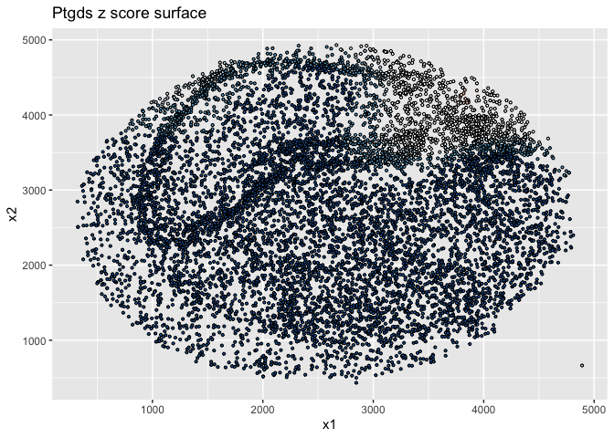
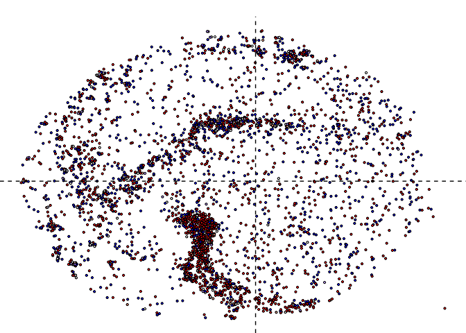
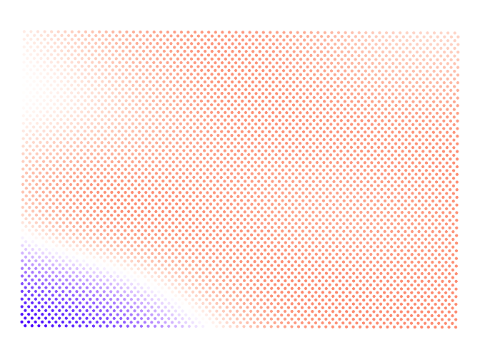

Cell type and X-chromosome figures
================

- <a href="#load-in-data" id="toc-load-in-data">Load in data</a>
- <a href="#cell-type" id="toc-cell-type">Cell type</a>
  - <a href="#cell-type-map---hippo" id="toc-cell-type-map---hippo">Cell
    type map - hippo</a>
  - <a href="#cell-type-map---cere" id="toc-cell-type-map---cere">Cell type
    map - cere</a>
  - <a href="#ptgds" id="toc-ptgds">Ptgds</a>
  - <a href="#sst" id="toc-sst">Sst</a>
  - <a href="#bex2-uba1-tspan7" id="toc-bex2-uba1-tspan7">Bex2, Uba1,
    Tspan7</a>
- <a href="#x-chromosome" id="toc-x-chromosome">X-chromosome</a>
  - <a href="#hippo-1" id="toc-hippo-1">Hippo 1</a>
    - <a href="#merge" id="toc-merge">Merge</a>
  - <a href="#hippo-2" id="toc-hippo-2">Hippo 2</a>
  - <a href="#cere-3" id="toc-cere-3">Cere 3</a>
    - <a href="#merge-1" id="toc-merge-1">Merge</a>
  - <a href="#hippo-3" id="toc-hippo-3">Hippo 3</a>
    - <a href="#merge-2" id="toc-merge-2">Merge</a>
  - <a href="#cere-4" id="toc-cere-4">Cere 4</a>
  - <a href="#mix-5" id="toc-mix-5">Mix 5</a>
- <a href="#x-chromosome-counts-vs.-xist-counts"
  id="toc-x-chromosome-counts-vs.-xist-counts">X-chromosome counts
  vs. Xist counts</a>

``` r
library(spacexr)
library(spASE)
```

    Registered S3 method overwritten by 'spASE':
      method             from   
      merge.RCTD.objects spacexr


    Attaching package: 'spASE'

    The following objects are masked from 'package:spacexr':

        aggregate_cell_types, build.designmatrix.intercept,
        build.designmatrix.nonparam, build.designmatrix.regions,
        build.designmatrix.single, choose_sigma_c, convert.old.RCTD,
        count_cell_types, create_RCTD_plots, create.RCTD,
        create.RCTD.replicates, CSIDE.population.inference,
        exvar.celltocell.interactions, exvar.point.density, fitBulk,
        fitPixels, get_cell_type_info, get_de_genes, get_doublet_weights,
        get_norm_ref, get_standard_errors, import_weights,
        make_all_de_plots, make_de_plots_genes, make_de_plots_quant,
        make_de_plots_regions, make_de_plots_replicates,
        make_de_plots_spatial, normalize_weights, plot_all_cell_types,
        plot_class, plot_cond_occur, plot_doub_occur_stack, plot_doublets,
        plot_doublets_type, plot_gene_raw, plot_gene_regions,
        plot_gene_two_regions, plot_occur_unthreshold,
        plot_prediction_gene, plot_puck_continuous, plot_puck_wrapper,
        plot_weights, plot_weights_doublet, plot_weights_unthreshold,
        process_beads_batch, process_data, read.SpatialRNA,
        read.VisiumSpatialRNA, Reference, restrict_counts, restrict_puck,
        run.CSIDE, run.CSIDE.general, run.CSIDE.intercept,
        run.CSIDE.nonparam, run.CSIDE.regions, run.CSIDE.replicates,
        run.CSIDE.single, run.RCTD, run.RCTD.replicates,
        save.CSIDE.replicates, set_cell_types_assigned,
        set_likelihood_vars, SpatialRNA, write_de_summary

``` r
library(dplyr)
```


    Attaching package: 'dplyr'

    The following objects are masked from 'package:stats':

        filter, lag

    The following objects are masked from 'package:base':

        intersect, setdiff, setequal, union

``` r
library(Matrix)
library(data.table)
```


    Attaching package: 'data.table'

    The following objects are masked from 'package:dplyr':

        between, first, last

``` r
library(rtracklayer)
```

    Loading required package: GenomicRanges

    Loading required package: stats4

    Loading required package: BiocGenerics


    Attaching package: 'BiocGenerics'

    The following objects are masked from 'package:dplyr':

        combine, intersect, setdiff, union

    The following objects are masked from 'package:stats':

        IQR, mad, sd, var, xtabs

    The following objects are masked from 'package:base':

        anyDuplicated, aperm, append, as.data.frame, basename, cbind,
        colnames, dirname, do.call, duplicated, eval, evalq, Filter, Find,
        get, grep, grepl, intersect, is.unsorted, lapply, Map, mapply,
        match, mget, order, paste, pmax, pmax.int, pmin, pmin.int,
        Position, rank, rbind, Reduce, rownames, sapply, setdiff, sort,
        table, tapply, union, unique, unsplit, which.max, which.min

    Loading required package: S4Vectors


    Attaching package: 'S4Vectors'

    The following objects are masked from 'package:data.table':

        first, second

    The following objects are masked from 'package:Matrix':

        expand, unname

    The following objects are masked from 'package:dplyr':

        first, rename

    The following object is masked from 'package:utils':

        findMatches

    The following objects are masked from 'package:base':

        expand.grid, I, unname

    Loading required package: IRanges


    Attaching package: 'IRanges'

    The following object is masked from 'package:data.table':

        shift

    The following objects are masked from 'package:dplyr':

        collapse, desc, slice

    Loading required package: GenomeInfoDb

``` r
library(tibble)
library(ggplot2)
library(ggthemes)
```

# Load in data

# Cell type

## Cell type map - hippo

``` r
rctd_hippo <- readRDS('results/rctd_hippo_3.rds')
```

``` r
hippo_ct <- left_join(rctd_hippo@originalSpatialRNA@coords |> rownames_to_column(), rctd_hippo@results$results_df |> rownames_to_column()) |> filter(!is.na(first_type)) |> mutate(first_type = as.character(first_type))
```

    Joining with `by = join_by(rowname)`

``` r
hippo_ct$first_type[grepl('Endothelial', hippo_ct$first_type)] <- 'Endothelial' # merge endothelials
```

``` r
hippo_ct |> 
  filter(spot_class %in% c('singlet')) |>
  filter(first_type %in% c('Astrocyte', 'CA1', 'CA3', 'Dentate', 'Interneuron', 'Oligodendrocyte', 'Choroid', 'Entorihinal', 'Endothelial')) |>
  filter(!rowname %in% c('ATACCTATCTCGTA_2', 'CTACGCAAAGCTTG_1', 'GCGGTGGCGCTATC_1')) |> # remove stragglers
  ggplot(aes(x = x, y = y)) +
  geom_point(aes(color = first_type), size=0.1) +
  scale_color_tableau() +
  theme_void() +
  theme(legend.position = 'none')
```


``` r
ggsave('figures/05_hippo_3_celltype_map.pdf', height=3, width=3)

hippo_ct |> 
  filter(spot_class == 'singlet') |>
  filter(first_type %in% c('Astrocyte', 'CA1', 'CA3', 'Dentate', 'Interneuron', 'Oligodendrocyte', 'Choroid', 'Entorihinal', 'Endothelial')) |>
  mutate(first_type = ifelse(first_type == 'Entorihinal', 'Entorhinal', first_type)) |>
  filter(!rowname %in% c('ATACCTATCTCGTA_2', 'CTACGCAAAGCTTG_1', 'GCGGTGGCGCTATC_1')) |>
  ggplot(aes(x = x, y = y)) +
  geom_point(aes(color = first_type), size=1) +
  scale_color_tableau(name='') +
  theme_void() 
```


``` r
ggsave('figures/05_hippo_3_celltype_map_legend.pdf', height=3, width=3)
```

## Cell type map - cere

``` r
rctd_cere <- readRDS('results/rctd_cere_3.rds')
cere_ct <- left_join(rctd_cere@originalSpatialRNA@coords |> rownames_to_column(), rctd_cere@results$results_df |> rownames_to_column()) |> filter(!is.na(first_type)) |> mutate(first_type = as.character(first_type))
```

    Joining with `by = join_by(rowname)`

``` r
cere_ct |> 
  filter(spot_class %in% c('singlet')) |>
  filter(first_type %in% c('Astrocytes', 'Fibroblast', 'Granule', 'MLI1', 'MLI2', 'Purkinje', 'Bergmann', 'Oligodendrocytes', 'Endothelial')) |>
  filter(y > 1000, x > 1000) |>
  ggplot(aes(x = x, y = y)) +
  geom_point(aes(color = first_type), size=0.1) +
  scale_color_tableau() +
  theme_void() +
  theme(legend.position = 'none')
```


``` r
ggsave('figures/05_cere_3_celltype_map.pdf', height=3, width=3)

cere_ct |> 
  filter(spot_class %in% c('singlet')) |>
  filter(first_type %in% c('Astrocytes', 'Fibroblast', 'Granule', 'MLI1', 'MLI2', 'Purkinje', 'Bergmann', 'Oligodendrocytes', 'Endothelial')) |>
  filter(y > 1000, x > 1000) |>
  ggplot(aes(x = x, y = y)) +
  geom_point(aes(color = first_type), size=1) +
  scale_color_tableau() +
  theme_void() 
```


``` r
ggsave('figures/05_cere_3_celltype_map_legend.pdf', height=3, width=3)
```

``` r
myfit_hippo <- spase(rctd_hippo@originalSpatialRNA@maternalCounts, rctd_hippo@originalSpatialRNA@paternalCounts, rctd_hippo@originalSpatialRNA@coords |> rownames_to_column(),cores=1,verbose=T, df=15, genes=c('Nrip3', 'Ptgds', 'Sst'))
```

    4561 genes pass min threshold of 100 pixels, 500 UMI

    running on 3 user-specified genes

    found 3 columns in covariates; going to assume that first column is pixel names, 2nd and 3rd column are 2D coordinates


      |                                                                            
      |                                                                      |   0%
      |                                                                            
      |=======================                                               |  33%
      |                                                                            
      |===============================================                       |  67%
      |                                                                            
      |======================================================================| 100%

## Ptgds

``` r
plotSpase(
  matrix1 = rctd_hippo@originalSpatialRNA@maternalCounts, 
  matrix2 = rctd_hippo@originalSpatialRNA@paternalCounts, 
  covariates = rctd_hippo@originalSpatialRNA@coords |> rownames_to_column(), 
  spasefit = myfit_hippo, 
  coords = rctd_hippo@originalSpatialRNA@coords  |> select(x,y) |> sample_n(10000), 
  genes = c('Ptgds'),
  crosshairs = F,
  crosshairs_diag = T,
  point.size = 0.75,
  size.scale = F,
  theme = 'void',
  void = T,
  #save = 'figures/05_Crosshairs'
)
```

    found 3 columns in covariates; going to assume that first column is pixel names, 2nd and 3rd column are 2D coordinates

    [1] "Ptgds"





## Sst

``` r
plotSpase(
  matrix1 = rctd_hippo@originalSpatialRNA@maternalCounts, 
  matrix2 = rctd_hippo@originalSpatialRNA@paternalCounts, 
  covariates = rctd_hippo@originalSpatialRNA@coords |> rownames_to_column(), 
  spasefit = myfit_hippo, 
  coords = rctd_hippo@originalSpatialRNA@coords  |> select(x,y) |> sample_n(10000), 
  genes = c('Sst'),
  crosshairs = T,
  point.size = 0.75,
  size.scale = F,
  theme = 'void',
  void = T,
  #save = 'figures/05_Crosshairs'
)
```

    found 3 columns in covariates; going to assume that first column is pixel names, 2nd and 3rd column are 2D coordinates

    [1] "Sst"




## Bex2, Uba1, Tspan7

``` r
myfit_cere <- spase(rctd_cere@originalSpatialRNA@maternalCounts, rctd_cere@originalSpatialRNA@paternalCounts, rctd_cere@originalSpatialRNA@coords |> rownames_to_column(),cores=1,verbose=T, df=15, genes=c('Uba1', 'Bex2', 'Tspan7'))
```

    4506 genes pass min threshold of 100 pixels, 500 UMI

    running on 3 user-specified genes

    found 3 columns in covariates; going to assume that first column is pixel names, 2nd and 3rd column are 2D coordinates


      |                                                                            
      |                                                                      |   0%
      |                                                                            
      |=======================                                               |  33%
      |                                                                            
      |===============================================                       |  67%
      |                                                                            
      |======================================================================| 100%

``` r
plotSpase(
  matrix1 = rctd_cere@originalSpatialRNA@maternalCounts, 
  matrix2 = rctd_cere@originalSpatialRNA@paternalCounts, 
  covariates = rctd_cere@originalSpatialRNA@coords |> rownames_to_column(), 
  spasefit = myfit_cere, 
  coords = rctd_cere@originalSpatialRNA@coords |>  select(x,y) |> sample_n(10000), 
  genes = c('Uba1'),
  crosshairs = T,
  point.size = 0.75,
  size.scale = F,
  theme = 'void',
  void = T,
  #save = 'figures/05'
)
```

    found 3 columns in covariates; going to assume that first column is pixel names, 2nd and 3rd column are 2D coordinates

    [1] "Uba1"


``` r
plotSpase(
  matrix1 = rctd_cere@originalSpatialRNA@maternalCounts, 
  matrix2 = rctd_cere@originalSpatialRNA@paternalCounts, 
  covariates = rctd_cere@originalSpatialRNA@coords |> rownames_to_column(), 
  spasefit = myfit_cere, 
  coords = cere_ct |> 
    filter(spot_class %in% c('singlet')) |>
    filter(first_type %in% c('Granule')) |> select(x,y) |> filter(x>1000, y>1000), 
  genes = c('Uba1'),
  crosshairs = F,
  point.size = 0.75,
  size.scale = F,
  theme = 'void',
  void = T,
  #save = 'figures/05_granule'
)
```

    found 3 columns in covariates; going to assume that first column is pixel names, 2nd and 3rd column are 2D coordinates

    [1] "Uba1"


``` r
plotSpase(
  matrix1 = rctd_cere@originalSpatialRNA@maternalCounts, 
  matrix2 = rctd_cere@originalSpatialRNA@paternalCounts, 
  covariates = rctd_cere@originalSpatialRNA@coords |> rownames_to_column(), 
  spasefit = myfit_cere, 
  coords = cere_ct |> 
    filter(spot_class %in% c('singlet')) |>
    filter(first_type %in% c('Granule')) |> select(x,y) |> filter(x > 1000, y > 1000), 
  genes = c('Tspan7'),
  crosshairs = F,
  point.size = 0.75,
  size.scale = F,
  theme = 'void',
  void = T,
 # save = 'figures/05_granule'
)
```

    found 3 columns in covariates; going to assume that first column is pixel names, 2nd and 3rd column are 2D coordinates

    [1] "Tspan7"


# X-chromosome

``` r
# Read in gencode to grab xchr genes
gencode <- import('results/gencode.vM10.annotation.gff3.gz')
xchr_genes <- unique(gencode$gene_name[which(seqnames(gencode)=='chrX')])
xchr_genes <- c(xchr_genes, 'Bex3')
```

## Hippo 1

``` r
hippo1 <- readRDS('results/rctd_hippo_1.rds')
maternal_counts_matrix_hippo <- hippo1@originalSpatialRNA@maternalCounts
paternal_counts_matrix_hippo <- hippo1@originalSpatialRNA@paternalCounts
coords_hippo <- hippo1@originalSpatialRNA@coords |> rownames_to_column()
```

### Merge

Merge all X-chromosome genes except Xist

``` r
x_inactive <- xchr_genes[-which(xchr_genes == 'Xist')]
xchr_idx <- rownames(maternal_counts_matrix_hippo) %in% x_inactive
maternal_counts_x <- t(as.matrix(colSums(maternal_counts_matrix_hippo[xchr_idx,])))
paternal_counts_x <- t(as.matrix(colSums(paternal_counts_matrix_hippo[xchr_idx,])))
maternal_counts_x <- rbind(maternal_counts_x, maternal_counts_matrix_hippo['Xist',])
paternal_counts_x <- rbind(paternal_counts_x, paternal_counts_matrix_hippo['Xist',])
rownames(maternal_counts_x) <- rownames(paternal_counts_x) <- c('X','Xist')
myfit_hippo <- spase(maternal_counts_x, paternal_counts_x, coords_hippo,cores=1,verbose=T, df=15, genes = c('X', 'Xist'))
```

    2 genes pass min threshold of 100 pixels, 500 UMI

    running on 2 user-specified genes

    found 3 columns in covariates; going to assume that first column is pixel names, 2nd and 3rd column are 2D coordinates


      |                                                                            
      |                                                                      |   0%
      |                                                                            
      |===================================                                   |  50%
      |                                                                            
      |======================================================================| 100%

``` r
plotSpase(
  matrix1 = maternal_counts_x, 
  matrix2 = paternal_counts_x, 
  covariates = coords_hippo, 
  spasefit = myfit_hippo, 
  coords = coords_hippo |> select(x,y) |> sample_n(10000), 
  genes = c('X', 'Xist'),
  crosshairs = T,
  crosshairs_diag = F,
  point.size = 0.75,
  size.scale = F,
  theme = 'void',
  void = T,
  #save = 'figures/05_mergedX_hippo1'
)
```

    found 3 columns in covariates; going to assume that first column is pixel names, 2nd and 3rd column are 2D coordinates

    [1] "X"


    [1] "Xist"


## Hippo 2

``` r
hippo2 <- readRDS('results/rctd_hippo_2.rds')
maternal_counts_matrix_hippo <- hippo2@originalSpatialRNA@maternalCounts
paternal_counts_matrix_hippo <- hippo2@originalSpatialRNA@paternalCounts
coords_hippo <- hippo2@originalSpatialRNA@coords |> rownames_to_column()
```

``` r
x_inactive <- xchr_genes[-which(xchr_genes == 'Xist')]
xchr_idx <- rownames(maternal_counts_matrix_hippo) %in% x_inactive
maternal_counts_x <- t(as.matrix(colSums(maternal_counts_matrix_hippo[xchr_idx,])))
paternal_counts_x <- t(as.matrix(colSums(paternal_counts_matrix_hippo[xchr_idx,])))
rownames(maternal_counts_x) <- rownames(paternal_counts_x) <- c('X')
myfit_hippo <- spase(maternal_counts_x, paternal_counts_x, coords_hippo,cores=1,verbose=T, df=15, genes = c('X'))
```

    1 genes pass min threshold of 100 pixels, 500 UMI

    running on 1 user-specified genes

    found 3 columns in covariates; going to assume that first column is pixel names, 2nd and 3rd column are 2D coordinates


      |                                                                            
      |                                                                      |   0%
      |                                                                            
      |======================================================================| 100%

``` r
plotSpase(
  matrix1 = maternal_counts_x, 
  matrix2 = paternal_counts_x, 
  covariates = coords_hippo, 
  spasefit = myfit_hippo, 
  coords = coords_hippo |> select(x,y) |> sample_n(10000), 
  genes = c('X'),
  crosshairs = F,
  crosshairs_diag = F,
  point.size = 0.75,
  size.scale = F,
  theme = 'void',
  void = T,
  #save = 'figures/05_mergedX_hippo2'
)
```

    found 3 columns in covariates; going to assume that first column is pixel names, 2nd and 3rd column are 2D coordinates

    [1] "X"


## Cere 3

``` r
cere3 <- readRDS('results/rctd_cere_3.rds')
maternal_counts_matrix_cere <- cere3@originalSpatialRNA@maternalCounts
paternal_counts_matrix_cere <- cere3@originalSpatialRNA@paternalCounts
coords_cere <- cere3@originalSpatialRNA@coords |> rownames_to_column()
```

### Merge

Merge all X-chromosome genes except Xist

``` r
x_inactive <- xchr_genes[-which(xchr_genes == 'Xist')]
xchr_idx <- rownames(maternal_counts_matrix_cere) %in% x_inactive
maternal_counts_x <- t(as.matrix(colSums(maternal_counts_matrix_cere[xchr_idx,])))
paternal_counts_x <- t(as.matrix(colSums(paternal_counts_matrix_cere[xchr_idx,])))
maternal_counts_x <- rbind(maternal_counts_x, maternal_counts_matrix_cere['Xist',])
paternal_counts_x <- rbind(paternal_counts_x, paternal_counts_matrix_cere['Xist',])
rownames(maternal_counts_x) <- rownames(paternal_counts_x) <- c('X', 'Xist')
myfit_cere <- spase(maternal_counts_x, paternal_counts_x, coords_cere,cores=1,verbose=T, df=15, genes = c('X', 'Xist'))
```

    2 genes pass min threshold of 100 pixels, 500 UMI

    running on 2 user-specified genes

    found 3 columns in covariates; going to assume that first column is pixel names, 2nd and 3rd column are 2D coordinates


      |                                                                            
      |                                                                      |   0%
      |                                                                            
      |===================================                                   |  50%
      |                                                                            
      |======================================================================| 100%

``` r
plotSpase(
  matrix1 = maternal_counts_x, 
  matrix2 = paternal_counts_x, 
  covariates = coords_cere, 
  spasefit = myfit_cere, 
  coords = coords_cere |> select(x,y) |> sample_n(10000), 
  genes = c('X', 'Xist'),
  crosshairs = T,
  crosshairs_diag = F,
  point.size = 0.75,
  size.scale = F,
  theme = 'void',
  void = T,
 # save = 'figures/05_mergedX_cere3'
)
```

    found 3 columns in covariates; going to assume that first column is pixel names, 2nd and 3rd column are 2D coordinates

    [1] "X"


    [1] "Xist"


## Hippo 3

### Merge

Merge all X-chromosome genes except Xist

``` r
x_inactive <- xchr_genes[-which(xchr_genes == 'Xist')]
xchr_idx <- rownames(maternal_counts_matrix_hippo) %in% x_inactive
maternal_counts_x <- t(as.matrix(colSums(maternal_counts_matrix_hippo[xchr_idx,])))
paternal_counts_x <- t(as.matrix(colSums(paternal_counts_matrix_hippo[xchr_idx,])))
maternal_counts_x <- rbind(maternal_counts_x, maternal_counts_matrix_hippo['Xist',])
paternal_counts_x <- rbind(paternal_counts_x, paternal_counts_matrix_hippo['Xist',])
rownames(maternal_counts_x) <- rownames(paternal_counts_x) <- c('X','Xist')
myfit_hippo <- spase(maternal_counts_x, paternal_counts_x, coords_hippo,cores=1,verbose=T, df=15, genes = c('X', 'Xist'), min.pixels=50, min.umi=50)
```

    2 genes pass min threshold of 50 pixels, 50 UMI

    running on 2 user-specified genes

    found 3 columns in covariates; going to assume that first column is pixel names, 2nd and 3rd column are 2D coordinates


      |                                                                            
      |                                                                      |   0%
      |                                                                            
      |===================================                                   |  50%
      |                                                                            
      |======================================================================| 100%

``` r
plotSpase(
  matrix1 = maternal_counts_x, 
  matrix2 = paternal_counts_x, 
  covariates = coords_hippo, 
  spasefit = myfit_hippo, 
  coords = coords_hippo |> select(x,y) |> sample_n(10000), 
  genes = c('X', 'Xist'),
  crosshairs = F,
  crosshairs_diag = F,
  point.size = 0.75,
  size.scale = F,
  theme = 'void',
  void = T,
  #save = 'figures/05_mergedX_hippo3'
)
```

    found 3 columns in covariates; going to assume that first column is pixel names, 2nd and 3rd column are 2D coordinates

    [1] "X"


    [1] "Xist"


## Cere 4

``` r
cere4 <- readRDS('results/rctd_cere_4_visium.rds')
maternal_counts_matrix_cere <- cere4@originalSpatialRNA@maternalCounts
paternal_counts_matrix_cere <- cere4@originalSpatialRNA@paternalCounts
coords_cere <- cere4@originalSpatialRNA@coords |> rownames_to_column()
```

``` r
x_inactive <- xchr_genes[-which(xchr_genes == 'Xist')]
xchr_idx <- rownames(maternal_counts_matrix_cere) %in% x_inactive
maternal_counts_x <- t(as.matrix(colSums(maternal_counts_matrix_cere[xchr_idx,])))
paternal_counts_x <- t(as.matrix(colSums(paternal_counts_matrix_cere[xchr_idx,])))
rownames(maternal_counts_x) <- rownames(paternal_counts_x) <- c('X')
myfit_cere <- spase(maternal_counts_x, paternal_counts_x, coords_cere,cores=1,verbose=T, df=15, genes = c('X'))
```

    1 genes pass min threshold of 100 pixels, 500 UMI

    running on 1 user-specified genes

    found 3 columns in covariates; going to assume that first column is pixel names, 2nd and 3rd column are 2D coordinates


      |                                                                            
      |                                                                      |   0%
      |                                                                            
      |======================================================================| 100%

``` r
plotSpase(
  matrix1 = maternal_counts_x, 
  matrix2 = paternal_counts_x, 
  covariates = coords_cere, 
  spasefit = myfit_cere, 
  coords = coords_cere |> select(x,y), 
  genes = c('X'),
  crosshairs = F,
  crosshairs_diag = F,
  point.size = 0.75,
  size.scale = F,
  theme = 'void',
  void = T,
  #save = 'figures/05_mergedX_cere4'
)
```

    found 3 columns in covariates; going to assume that first column is pixel names, 2nd and 3rd column are 2D coordinates

    [1] "X"


``` r
plotSpase(
  matrix1 = maternal_counts_x, 
  matrix2 = paternal_counts_x, 
  covariates = coords_cere, 
  spasefit = myfit_cere, 
  coords = coords_cere |> select(x,y), 
  genes = c('X'),
  crosshairs = F,
  crosshairs_diag = T,
  point.size = 0.75,
  size.scale = F,
  theme = 'void',
  void = T,
 # save = 'figures/05_mergedX_cere4_cross'
)
```

    found 3 columns in covariates; going to assume that first column is pixel names, 2nd and 3rd column are 2D coordinates

    [1] "X"


## Mix 5

``` r
mix5 <- readRDS('results/rctd_mix_5_visium.rds')
maternal_counts_matrix <- mix5@originalSpatialRNA@maternalCounts
paternal_counts_matrix <- mix5@originalSpatialRNA@paternalCounts
positions <- mix5@originalSpatialRNA@coords |> rownames_to_column()
```

``` r
x_inactive <- xchr_genes[-which(xchr_genes == 'Xist')]
xchr_idx <- rownames(maternal_counts_matrix) %in% x_inactive
maternal_counts_x <- t(as.matrix(colSums(maternal_counts_matrix[xchr_idx,])))
paternal_counts_x <- t(as.matrix(colSums(paternal_counts_matrix[xchr_idx,])))
rownames(maternal_counts_x) <- rownames(paternal_counts_x) <- c('X')
myfit <- spase(maternal_counts_x, paternal_counts_x, positions,cores=1,verbose=T, df=15, genes = c('X'))
```

    1 genes pass min threshold of 100 pixels, 500 UMI

    running on 1 user-specified genes

    found 3 columns in covariates; going to assume that first column is pixel names, 2nd and 3rd column are 2D coordinates


      |                                                                            
      |                                                                      |   0%
      |                                                                            
      |======================================================================| 100%

``` r
plotSpase(
  matrix1 = maternal_counts_x, 
  matrix2 = paternal_counts_x, 
  covariates = positions, 
  spasefit = myfit, 
  coords = positions |> select(x,y), 
  genes = c('X'),
  crosshairs = F,
  crosshairs_diag = F,
  point.size = 0.75,
  size.scale = F,
  theme = 'void',
  void = T,
  #save = 'figures/05_mergedX_mix5'
)
```

    found 3 columns in covariates; going to assume that first column is pixel names, 2nd and 3rd column are 2D coordinates

    [1] "X"





``` r
plotSpase(
  matrix1 = maternal_counts_x, 
  matrix2 = paternal_counts_x, 
  covariates = positions, 
  spasefit = myfit, 
  coords = positions |> select(x,y), 
  genes = c('X'),
  crosshairs = F,
  crosshairs_diag = T,
  point.size = 0.75,
  size.scale = F,
  theme = 'void',
  void = T,
 # save = 'figures/05_mergedX_mix5_cross'
)
```

    found 3 columns in covariates; going to assume that first column is pixel names, 2nd and 3rd column are 2D coordinates

    [1] "X"


# X-chromosome counts vs. Xist counts

Is having more Xist counts relative to X-chromosome counts associated
with greater variance in maternal proportion

``` r
xx <- data.frame(samples = c('Mouse 1 Hippo', 'Mouse 2 Hippo', 'Mouse 3 Hippo', 'Mouse 3 Cere', 'Mouse 4 Cere', 'Mouse 5 Mix'), X=numeric(6), Xist=numeric(6), phi=numeric(6))
```

``` r
hippo1 <- readRDS('results/rctd_hippo_1.rds')
maternal_counts_matrix_hippo <- hippo1@originalSpatialRNA@maternalCounts
paternal_counts_matrix_hippo <- hippo1@originalSpatialRNA@paternalCounts
x_inactive <- xchr_genes[-which(xchr_genes == 'Xist')]
xchr_idx <- rownames(maternal_counts_matrix_hippo) %in% x_inactive
maternal_counts_x <- t(as.matrix(colSums(maternal_counts_matrix_hippo[xchr_idx,])))
paternal_counts_x <- t(as.matrix(colSums(paternal_counts_matrix_hippo[xchr_idx,])))
maternal_counts_x <- rbind(maternal_counts_x, maternal_counts_matrix_hippo['Xist',])
paternal_counts_x <- rbind(paternal_counts_x, paternal_counts_matrix_hippo['Xist',])
rownames(maternal_counts_x) <- rownames(paternal_counts_x) <- c('X','Xist')
myfit <- scase(maternal_counts_x, paternal_counts_x, cores=1, verbose=T, genes = 'X')
```

    using user-supplied genes


      |                                                                            
      |                                                                      |   0%
      |                                                                            
      |======================================================================| 100%

``` r
xx[1,2:4] <- c(as.numeric(rowSums(maternal_counts_x + paternal_counts_x)), myfit$phi)

hippo2 <- readRDS('results/rctd_hippo_2.rds')
maternal_counts_matrix_hippo <- hippo2@originalSpatialRNA@maternalCounts
paternal_counts_matrix_hippo <- hippo2@originalSpatialRNA@paternalCounts
x_inactive <- xchr_genes[-which(xchr_genes == 'Xist')]
xchr_idx <- rownames(maternal_counts_matrix_hippo) %in% x_inactive
maternal_counts_x <- t(as.matrix(colSums(maternal_counts_matrix_hippo[xchr_idx,])))
paternal_counts_x <- t(as.matrix(colSums(paternal_counts_matrix_hippo[xchr_idx,])))
maternal_counts_x <- rbind(maternal_counts_x, maternal_counts_matrix_hippo['Xist',])
paternal_counts_x <- rbind(paternal_counts_x, paternal_counts_matrix_hippo['Xist',])
rownames(maternal_counts_x) <- rownames(paternal_counts_x) <- c('X','Xist')
myfit <- scase(maternal_counts_x, paternal_counts_x, cores=1, verbose=T, genes = 'X')
```

    using user-supplied genes


      |                                                                            
      |                                                                      |   0%
      |                                                                            
      |======================================================================| 100%

``` r
xx[2,2:4] <- c(as.numeric(rowSums(maternal_counts_x + paternal_counts_x)), myfit$phi)

hippo3 <- readRDS('results/rctd_hippo_3.rds')
maternal_counts_matrix_hippo <- hippo3@originalSpatialRNA@maternalCounts
paternal_counts_matrix_hippo <- hippo3@originalSpatialRNA@paternalCounts
x_inactive <- xchr_genes[-which(xchr_genes == 'Xist')]
xchr_idx <- rownames(maternal_counts_matrix_hippo) %in% x_inactive
maternal_counts_x <- t(as.matrix(colSums(maternal_counts_matrix_hippo[xchr_idx,])))
paternal_counts_x <- t(as.matrix(colSums(paternal_counts_matrix_hippo[xchr_idx,])))
maternal_counts_x <- rbind(maternal_counts_x, maternal_counts_matrix_hippo['Xist',])
paternal_counts_x <- rbind(paternal_counts_x, paternal_counts_matrix_hippo['Xist',])
rownames(maternal_counts_x) <- rownames(paternal_counts_x) <- c('X','Xist')
myfit <- scase(maternal_counts_x, paternal_counts_x, cores=1, verbose=T, genes = 'X', min.cells=5)
```

    using user-supplied genes


      |                                                                            
      |                                                                      |   0%
      |                                                                            
      |======================================================================| 100%

``` r
xx[3,2:4] <- c(as.numeric(rowSums(maternal_counts_x + paternal_counts_x)), myfit$phi)

cere3 <- readRDS('results/rctd_cere_3.rds')
maternal_counts_matrix_cere <- cere3@originalSpatialRNA@maternalCounts
paternal_counts_matrix_cere <- cere3@originalSpatialRNA@paternalCounts
x_inactive <- xchr_genes[-which(xchr_genes == 'Xist')]
xchr_idx <- rownames(maternal_counts_matrix_cere) %in% x_inactive
maternal_counts_x <- t(as.matrix(colSums(maternal_counts_matrix_cere[xchr_idx,])))
paternal_counts_x <- t(as.matrix(colSums(paternal_counts_matrix_cere[xchr_idx,])))
maternal_counts_x <- rbind(maternal_counts_x, maternal_counts_matrix_cere['Xist',])
paternal_counts_x <- rbind(paternal_counts_x, paternal_counts_matrix_cere['Xist',])
rownames(maternal_counts_x) <- rownames(paternal_counts_x) <- c('X','Xist')
myfit <- scase(maternal_counts_x, paternal_counts_x, cores=1, verbose=T, genes = 'X', min.cells=5)
```

    using user-supplied genes


      |                                                                            
      |                                                                      |   0%
      |                                                                            
      |======================================================================| 100%

``` r
xx[4,2:4] <- c(as.numeric(rowSums(maternal_counts_x + paternal_counts_x)), myfit$phi)

cere4 <- readRDS('results/rctd_cere_4_visium.rds')
maternal_counts_matrix_cere <- cere4@originalSpatialRNA@maternalCounts
paternal_counts_matrix_cere <- cere4@originalSpatialRNA@paternalCounts
x_inactive <- xchr_genes[-which(xchr_genes == 'Xist')]
xchr_idx <- rownames(maternal_counts_matrix_cere) %in% x_inactive
maternal_counts_x <- t(as.matrix(colSums(maternal_counts_matrix_cere[xchr_idx,])))
paternal_counts_x <- t(as.matrix(colSums(paternal_counts_matrix_cere[xchr_idx,])))
maternal_counts_x <- rbind(maternal_counts_x, maternal_counts_matrix_cere['Xist',])
paternal_counts_x <- rbind(paternal_counts_x, paternal_counts_matrix_cere['Xist',])
rownames(maternal_counts_x) <- rownames(paternal_counts_x) <- c('X','Xist')
myfit <- scase(maternal_counts_x, paternal_counts_x, cores=1, verbose=T, genes = 'X', min.cells=5)
```

    using user-supplied genes


      |                                                                            
      |                                                                      |   0%
      |                                                                            
      |======================================================================| 100%

``` r
xx[5,2:4] <- c(as.numeric(rowSums(maternal_counts_x + paternal_counts_x)), myfit$phi)

mix5 <- readRDS('results/rctd_mix_5_visium.rds')
maternal_counts_matrix <- mix5@originalSpatialRNA@maternalCounts
paternal_counts_matrix <- mix5@originalSpatialRNA@paternalCounts
x_inactive <- xchr_genes[-which(xchr_genes == 'Xist')]
xchr_idx <- rownames(maternal_counts_matrix) %in% x_inactive
maternal_counts_x <- t(as.matrix(colSums(maternal_counts_matrix[xchr_idx,])))
paternal_counts_x <- t(as.matrix(colSums(paternal_counts_matrix[xchr_idx,])))
maternal_counts_x <- rbind(maternal_counts_x, maternal_counts_matrix_cere['Xist',])
```

    Warning in rbind(...): number of columns of result is not a multiple of vector
    length (arg 2)

``` r
paternal_counts_x <- rbind(paternal_counts_x, paternal_counts_matrix_cere['Xist',])
```

    Warning in rbind(...): number of columns of result is not a multiple of vector
    length (arg 2)

``` r
rownames(maternal_counts_x) <- rownames(paternal_counts_x) <- c('X','Xist')
myfit <- scase(maternal_counts_x, paternal_counts_x, cores=1, verbose=T, genes = 'X', min.cells=5)
```

    using user-supplied genes


      |                                                                            
      |                                                                      |   0%
      |                                                                            
      |======================================================================| 100%

``` r
xx[6,2:4] <- c(as.numeric(rowSums(maternal_counts_x + paternal_counts_x)), myfit$phi)
```

``` r
xx |>
  ggplot(aes(x = Xist/X, y = phi)) +
  geom_point(aes(color = samples)) +
  scale_color_tableau(name = 'Sample') +
  theme_classic() +
  xlab('Normalized Xist expression') +
  ylab('X-chromosome overdispersion')
```


``` r
ggsave(filename = 'figures/05_xchr_overdispersion_scatter_samples.pdf', height=3, width=5)
```

``` r
cor(xx$Xist/xx$X, xx$phi)^2
```

    [1] 0.3932727
