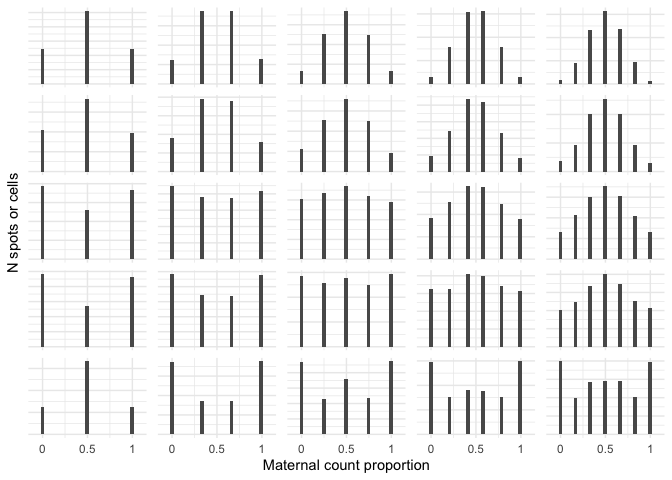
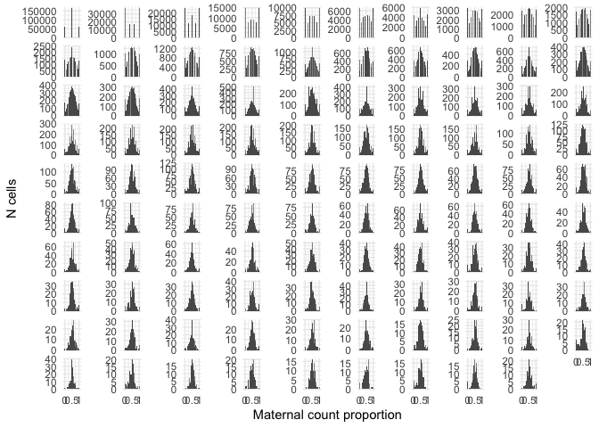

Visium and Slide-seq cerebellum, mixtures
================

- <a href="#characterizing-mixtures---histograms"
  id="toc-characterizing-mixtures---histograms">Characterizing mixtures -
  histograms</a>
  - <a href="#slide-seq" id="toc-slide-seq">Slide-seq</a>
    - <a href="#doublets" id="toc-doublets">Doublets</a>
    - <a href="#singlets" id="toc-singlets">Singlets</a>
  - <a href="#visium" id="toc-visium">Visium</a>
  - <a href="#binomial-sampling" id="toc-binomial-sampling">Binomial
    sampling</a>
  - <a href="#smart-seq3" id="toc-smart-seq3">Smart-seq3</a>
- <a href="#smart-seq3-only" id="toc-smart-seq3-only">Smart-seq3 only</a>

``` r
library(tibble)
library(latex2exp)
library(dplyr)
```


    Attaching package: 'dplyr'

    The following objects are masked from 'package:stats':

        filter, lag

    The following objects are masked from 'package:base':

        intersect, setdiff, setequal, union

``` r
library(ggplot2)
library(rtracklayer)
```

    Loading required package: GenomicRanges

    Loading required package: stats4

    Loading required package: BiocGenerics


    Attaching package: 'BiocGenerics'

    The following objects are masked from 'package:dplyr':

        combine, intersect, setdiff, union

    The following objects are masked from 'package:stats':

        IQR, mad, sd, var, xtabs

    The following objects are masked from 'package:base':

        anyDuplicated, aperm, append, as.data.frame, basename, cbind,
        colnames, dirname, do.call, duplicated, eval, evalq, Filter, Find,
        get, grep, grepl, intersect, is.unsorted, lapply, Map, mapply,
        match, mget, order, paste, pmax, pmax.int, pmin, pmin.int,
        Position, rank, rbind, Reduce, rownames, sapply, setdiff, sort,
        table, tapply, union, unique, unsplit, which.max, which.min

    Loading required package: S4Vectors


    Attaching package: 'S4Vectors'

    The following objects are masked from 'package:dplyr':

        first, rename

    The following object is masked from 'package:utils':

        findMatches

    The following objects are masked from 'package:base':

        expand.grid, I, unname

    Loading required package: IRanges


    Attaching package: 'IRanges'

    The following objects are masked from 'package:dplyr':

        collapse, desc, slice

    Loading required package: GenomeInfoDb

``` r
library(data.table)
```


    Attaching package: 'data.table'

    The following object is masked from 'package:GenomicRanges':

        shift

    The following object is masked from 'package:IRanges':

        shift

    The following objects are masked from 'package:S4Vectors':

        first, second

    The following objects are masked from 'package:dplyr':

        between, first, last

``` r
library(tidyr)
```


    Attaching package: 'tidyr'

    The following object is masked from 'package:S4Vectors':

        expand

``` r
library(Matrix)
```


    Attaching package: 'Matrix'

    The following objects are masked from 'package:tidyr':

        expand, pack, unpack

    The following object is masked from 'package:S4Vectors':

        expand

``` r
# for removing x chromosome genes
gencode <- import('results/gencode.vM10.annotation.gff3.gz')
xchr_genes <- unique(gencode$gene_name[which(seqnames(gencode)=='chrX')])
xchr_genes <- c(xchr_genes, 'Bex3')
```

# Characterizing mixtures - histograms

``` r
ss <- readRDS('results/rctd_cere_3.rds')
viz <- readRDS('results/rctd_cere_4_visium.rds')
```

## Slide-seq

``` r
rctd_res <- ss@results$results_df |> rownames_to_column(var = 'bead')
coords <- ss@spatialRNA@coords |> rownames_to_column(var = 'bead')
coords <- coords |> left_join(rctd_res |> select(bead, spot_class, first_type, second_type))
```

    Joining with `by = join_by(bead)`

``` r
doublets <- coords |> filter(grepl('doublet', spot_class)) |> pull(bead)
singlets <- coords |> filter(spot_class == 'singlet') |> pull(bead)
```

### Doublets

``` r
genes <- rownames(ss@spatialRNA@maternalCounts)
genes <- genes[-which(genes %in% xchr_genes)]
mat <- ss@spatialRNA@maternalCounts[genes,doublets]
pat <- ss@spatialRNA@paternalCounts[genes,doublets]
tot <- mat+pat
doub <- NULL
for (i in c(2:10)) {
  idx <- which(tot == i)
  y <- mat[idx]
  dd <- data.frame(
    mat = y,
    pat = i-y,
    class = 'doublets',
    tot = i
  )
  if (is.null(doub)) {
    doub <- dd
  } else {
    doub <- bind_rows(dd, doub)
  }
}
```

### Singlets

``` r
mat <- ss@spatialRNA@maternalCounts[genes,singlets]
pat <- ss@spatialRNA@paternalCounts[genes,singlets]
tot <- mat+pat
sing <- NULL
for (i in 2:10) {
  idx <- which(tot == i)
  y <- mat[idx]
  dd <- data.frame(
    mat = y,
    pat = i-y,
    class = 'singlets',
    tot = i
  )
  if (is.null(sing)) {
    sing <- dd
  } else {
    sing <- bind_rows(dd, sing)
  }
}
```

## Visium

``` r
coords_viz <- viz@spatialRNA@coords |> rownames_to_column(var = 'bead')
genes <- rownames(viz@spatialRNA@maternalCounts)
genes <- genes[-which(genes %in% xchr_genes)]
mat <- viz@spatialRNA@maternalCounts[genes,coords_viz$bead]
pat <- viz@spatialRNA@paternalCounts[genes,coords_viz$bead]
tot <- mat+pat
viz <- NULL
for (i in 2:10) {
  idx <- which(tot == i)
  y <- mat[idx]
  dd <- data.frame(
    mat = y,
    pat = i-y,
    class = 'visium',
    tot = i
  )
  if (is.null(viz)) {
    viz <- dd
  } else {
    viz <- bind_rows(dd, viz)
  }
}
```

## Binomial sampling

``` r
# perfect p=0.5 binomial sampling
binsamp <- NULL
for (i in 2:10) {
  y <- rbinom(10000, i, 0.5)
  dd <- data.frame(mat = y,
                   pat = i-y,
                   class = 'binomial',
                   tot = i)
  if (is.null(binsamp)) {
    binsamp <- dd
  } else {
    binsamp <- bind_rows(binsamp, dd)
  }
}
```

## Smart-seq3

``` r
c57 <- data.frame(fread('smartseq3/SS3_c57_UMIs_concat.csv'))
rownames(c57) <- c57$V1
c57$V1 <- NULL
cast <- data.frame(fread('smartseq3/SS3_cast_UMIs_concat.csv'))
rownames(cast) <- cast$V1
cast$V1 <- NULL

genes <- rownames(cast)
genes <- genes[-which(genes %in% xchr_genes)]

c57 <- Matrix(as.matrix(c57))[genes,]
cast <- Matrix(as.matrix(cast))[genes,]
tot <- c57+cast
```

``` r
ss3 <- NULL
for (i in 2:100) {
  idx <- which(tot == i)
  y <- c57[idx]
  dd <- data.frame(
    mat = y,
    pat = i-y,
    class = 'smart-seq3',
    tot = i
  )
  if (is.null(ss3)) {
    ss3 <- dd
  } else {
    ss3 <- bind_rows(dd, ss3)
  }
}
```

``` r
bind_rows(doub, sing, viz, binsamp, ss3) |>
  filter(tot < 7) |>
  mutate(tot_bin = cut(tot, breaks = c(0,1,2,3,4,5,6), include.lowest=F)) |>
  mutate(class = factor(class, levels = c('binomial', 'visium', 'doublets', 'singlets', 'smart-seq3'))) |>
  ggplot(aes(x = mat/tot)) +
  geom_histogram() +
  facet_wrap(class ~ tot_bin, scales='free_y', ncol = 5) +
  theme_minimal() +
  theme(strip.text = element_blank(), axis.text.y = element_blank()) +
  xlab('Maternal count proportion') +
  ylab('N spots or cells') +
  scale_x_continuous(breaks = c(0, 0.5, 1), limits = c(-0.1, 1.1), labels = c(0, 0.5, 1))
```

    `stat_bin()` using `bins = 30`. Pick better value with `binwidth`.

    Warning: Removed 50 rows containing missing values (`geom_bar()`).



``` r
ggsave('figures/06_singlet_doublet_all_histogram_2-6.pdf', height=3, width=4)
```

    `stat_bin()` using `bins = 30`. Pick better value with `binwidth`.

    Warning: Removed 50 rows containing missing values (`geom_bar()`).

# Smart-seq3 only

``` r
ss3 |>
  ggplot(aes(x = mat/tot)) +
  geom_histogram() +
  facet_wrap(tot ~ ., scales='free_y') +
  theme_minimal() +
  theme(strip.text = element_blank()) +
  xlab('Maternal count proportion') +
  ylab('N cells') +
  scale_x_continuous(breaks = c(0, 0.5, 1), limits = c(-0.1, 1.1), labels = c(0, 0.5, 1))
```

    `stat_bin()` using `bins = 30`. Pick better value with `binwidth`.

    Warning: Removed 198 rows containing missing values (`geom_bar()`).



``` r
ggsave('figures/06_smartseq3_2-100.pdf', height=6, width=8)
```

    `stat_bin()` using `bins = 30`. Pick better value with `binwidth`.

    Warning: Removed 198 rows containing missing values (`geom_bar()`).
