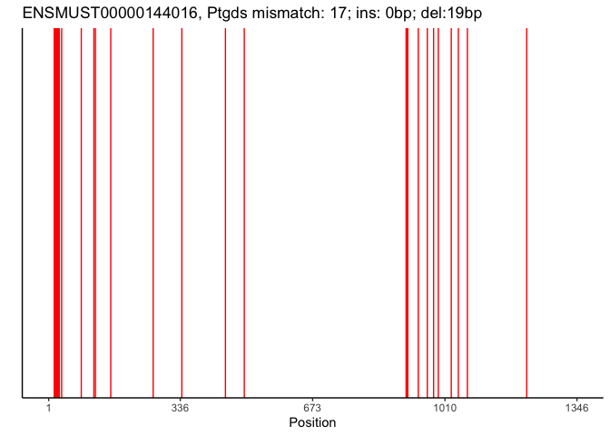
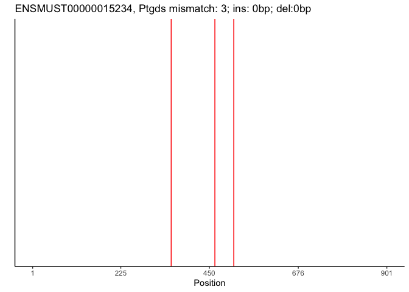
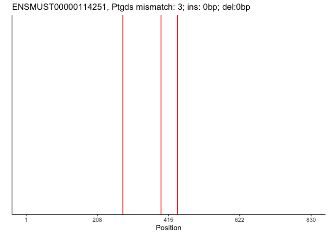
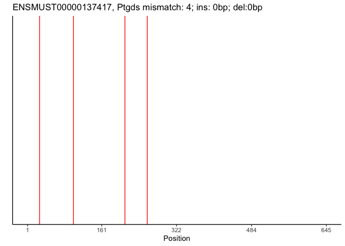
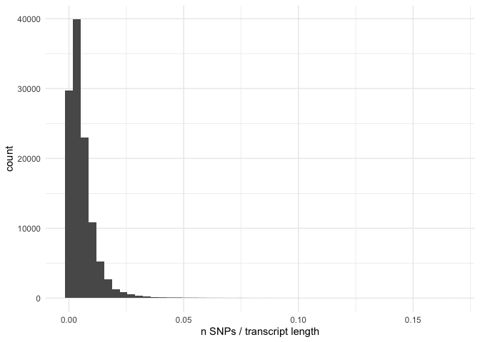
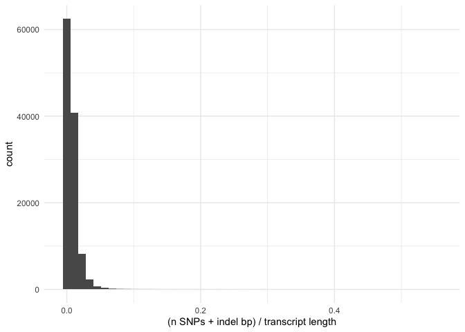
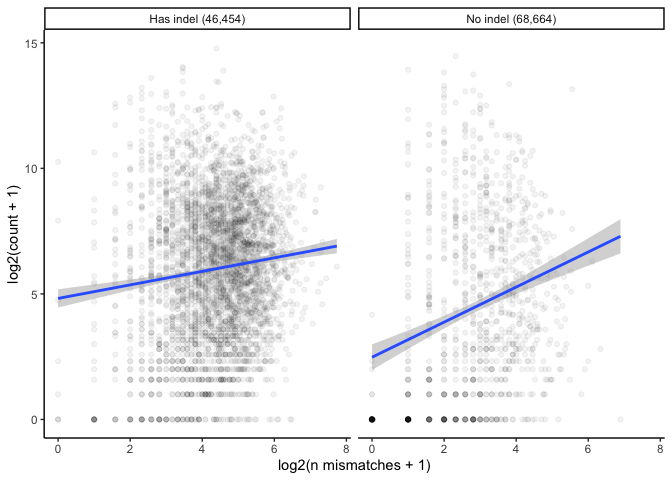

Analyzing 129 and CAST transcripts
================

- <a href="#load-in-data" id="toc-load-in-data">Load in data</a>
- <a href="#xist-example" id="toc-xist-example">Xist example</a>
- <a href="#all-transcripts" id="toc-all-transcripts">All transcripts</a>
- <a href="#summary-statistics" id="toc-summary-statistics">Summary
  statistics</a>
- <a href="#plot-number-of-reads-by-snps"
  id="toc-plot-number-of-reads-by-snps">Plot number of reads by SNPs</a>
- <a href="#total-number-of-snps-in-non-zero-count-genes"
  id="toc-total-number-of-snps-in-non-zero-count-genes">Total number of
  SNPs in non-zero count genes</a>

``` r
library(Biostrings)
```

    Loading required package: BiocGenerics


    Attaching package: 'BiocGenerics'

    The following objects are masked from 'package:stats':

        IQR, mad, sd, var, xtabs

    The following objects are masked from 'package:base':

        anyDuplicated, aperm, append, as.data.frame, basename, cbind,
        colnames, dirname, do.call, duplicated, eval, evalq, Filter, Find,
        get, grep, grepl, intersect, is.unsorted, lapply, Map, mapply,
        match, mget, order, paste, pmax, pmax.int, pmin, pmin.int,
        Position, rank, rbind, Reduce, rownames, sapply, setdiff, sort,
        table, tapply, union, unique, unsplit, which.max, which.min

    Loading required package: S4Vectors

    Loading required package: stats4


    Attaching package: 'S4Vectors'

    The following object is masked from 'package:utils':

        findMatches

    The following objects are masked from 'package:base':

        expand.grid, I, unname

    Loading required package: IRanges

    Loading required package: XVector

    Loading required package: GenomeInfoDb


    Attaching package: 'Biostrings'

    The following object is masked from 'package:base':

        strsplit

``` r
library(Matrix)
```


    Attaching package: 'Matrix'

    The following object is masked from 'package:S4Vectors':

        expand

``` r
library(ggplot2)
library(tidyr)
```


    Attaching package: 'tidyr'

    The following objects are masked from 'package:Matrix':

        expand, pack, unpack

    The following object is masked from 'package:S4Vectors':

        expand

``` r
library(dplyr)
```


    Attaching package: 'dplyr'

    The following objects are masked from 'package:Biostrings':

        collapse, intersect, setdiff, setequal, union

    The following object is masked from 'package:GenomeInfoDb':

        intersect

    The following object is masked from 'package:XVector':

        slice

    The following objects are masked from 'package:IRanges':

        collapse, desc, intersect, setdiff, slice, union

    The following objects are masked from 'package:S4Vectors':

        first, intersect, rename, setdiff, setequal, union

    The following objects are masked from 'package:BiocGenerics':

        combine, intersect, setdiff, union

    The following objects are masked from 'package:stats':

        filter, lag

    The following objects are masked from 'package:base':

        intersect, setdiff, setequal, union

``` r
library(tibble)
library(DECIPHER)
```

    Loading required package: RSQLite

    Loading required package: parallel

``` r
library(stringr)
```

# Load in data

``` r
tx <- readDNAStringSet('../inst/extdata/emase.pooled.targets.fa')
ensembl_ids <- read.csv('../inst/extdata/ensembl_tx_gene.csv')
tx_names <- tx@ranges@NAMES
tx_df <- tx_names |> 
  as.data.frame() |>
  separate(tx_names, into=c('tx', 'strain'), sep='_') |>
  left_join(ensembl_ids, by = c('tx' = 'ensembl_transcript_id'))
# create an index from the row idx 
tx_df <- tx_df |> 
  rownames_to_column(var = 'idx') |>
  pivot_wider(id_cols = c('tx', 'external_gene_name'), names_from = 'strain', values_from='idx')
colnames(tx_df) <- c('tx', 'gene', 's129', 'sCAST')
```

# Xist example

``` r
# all Xist transcripts
tx_df |> filter(gene=='Xist')
```

    # A tibble: 2 × 4
      tx                 gene  s129  sCAST 
      <chr>              <chr> <chr> <chr> 
    1 ENSMUST00000153883 Xist  4331  119456
    2 ENSMUST00000127786 Xist  69052 184177

``` r
# align each one
df <- tx_df |> filter(gene=='Xist')
for (i in 1:nrow(df)) {
  test <- pairwiseAlignment(as.character(tx[[as.integer(df$s129[i])]]), as.character(tx[[as.integer(df$sCAST[i])]]))
  s1 <- alignedPattern(test)
  s2 <- alignedSubject(test)
  sdf <- data.frame(
    idx = seq(1,width(s1)),
    s129 = unlist(str_split(as.character(s1), pattern='')),
    sCAST = unlist(str_split(as.character(s2), pattern=''))
  ) |>
    mutate(aligned = ifelse(s129==sCAST, 'lightgray', 'red')) 
  
  sdf |>
    pivot_longer(cols = c('s129', 'sCAST')) |>
    ggplot(aes(x = idx, y = factor(name))) +
    geom_vline(data= sdf |> filter(aligned=='red') |> unique(),
               aes(xintercept = idx), color = 'red', linewidth=0.5) +
    scale_x_continuous(breaks = c(1, round(width(s1)/4), round(width(s1)/2), round(width(s1)/4*3), width(s1)), labels = c(1, round(width(s1)/4), round(width(s1)/2), round(width(s1)/4*3), width(s1)), limits = c(1, width(s1))) +
    theme_classic() +
    ylab('') +
    xlab('Position') +
    ggtitle(paste0(df[i,1], ', ', df[i,2], ' mismatch: ', nmismatch(test), '; ins: ', as.integer(nindel(test)@insertion[,2]), 'bp; del:', as.integer(nindel(test)@deletion[,2]), 'bp'))
  ggsave(paste0('figures/07_',df[i,2],'_',df[i,1],'.pdf'),height=1, width=8)
}
```

``` r
plot_tx <- function(g) {
  df <- tx_df |> filter(gene==g)
  for (i in 1:nrow(df)) {
    test <- pairwiseAlignment(as.character(tx[[as.integer(df$s129[i])]]), as.character(tx[[as.integer(df$sCAST[i])]]))
    s1 <- alignedPattern(test)
    s2 <- alignedSubject(test)
    sdf <- data.frame(
      idx = seq(1,width(s1)),
      s129 = unlist(str_split(as.character(s1), pattern='')),
      sCAST = unlist(str_split(as.character(s2), pattern=''))
    ) |>
      mutate(aligned = ifelse(s129==sCAST, 'lightgray', 'red')) 
    
    print(sdf |>
      pivot_longer(cols = c('s129', 'sCAST')) |>
      ggplot(aes(x = idx, y = factor(name))) +
      geom_vline(data= sdf |> filter(aligned=='red') |> unique(),
                 aes(xintercept = idx), color = 'red', linewidth=0.5) +
      scale_x_continuous(breaks = c(1, round(width(s1)/4), round(width(s1)/2), round(width(s1)/4*3), width(s1)), labels = c(1, round(width(s1)/4), round(width(s1)/2), round(width(s1)/4*3), width(s1)), limits = c(1, width(s1))) +
      theme_classic() +
      ylab('') +
      xlab('Position') +
      ggtitle(paste0(df[i,1], ', ', df[i,2], ' mismatch: ', nmismatch(test), '; ins: ', as.integer(nindel(test)@insertion[,2]), 'bp; del:', as.integer(nindel(test)@deletion[,2]), 'bp')))
    ggsave(paste0('figures/07_',df[i,2],'_',df[i,1],'.pdf'),height=1, width=8)
  }
}
```

``` r
plot_tx('Ptgds')
```










# All transcripts

``` r
tx_df$nmismatch <- 0
tx_df$ins_bp <- 0
tx_df$del_bp <- 0
for (i in 1:nrow(tx_df)) {
  if (i%%1000 == 0) {
    message(i)
  }
  test <- try(pairwiseAlignment(as.character(tx[[as.integer(tx_df$s129[i])]]), as.character(tx[[as.integer(tx_df$sCAST[i])]])))
  if (is(test, 'try-error')) {
    tx_df$nmismatch[i] <- NA
    tx_df$ins_bp[i] <- NA
    tx_df$del_bp[i] <- NA
  } else {
    tx_df$nmismatch[i] <- nmismatch(test)
    tx_df$ins_bp[i] <- as.integer(nindel(test)@insertion[,2])
    tx_df$del_bp[i] <- as.integer(nindel(test)@deletion[,2])
  }
}
tx_df$width <- width(tx)[as.integer(tx_df$s129)]
saveRDS(tx_df, file = '07_129_CAST_df.rds')
```

``` r
tx_df <- readRDS('../inst/extdata/07_129_CAST_df.rds')
```

# Summary statistics

``` r
tx_df |>
  mutate(frac_mismatch = nmismatch/width,
         frac_mismatch_indel = (nmismatch + ins_bp + del_bp)/width) |>
  summary()
```

          tx                gene               s129              sCAST          
     Length:115125      Length:115125      Length:115125      Length:115125     
     Class :character   Class :character   Class :character   Class :character  
     Mode  :character   Mode  :character   Mode  :character   Mode  :character  
                                                                                
                                                                                
                                                                                
                                                                                
       nmismatch           ins_bp            del_bp           width       
     Min.   :  0.000   Min.   :  0.000   Min.   : 0.000   Min.   :     9  
     1st Qu.:  1.000   1st Qu.:  0.000   1st Qu.: 0.000   1st Qu.:   549  
     Median :  4.000   Median :  0.000   Median : 0.000   Median :   945  
     Mean   :  8.383   Mean   :  1.959   Mean   : 1.699   Mean   :  1694  
     3rd Qu.: 11.000   3rd Qu.:  1.000   3rd Qu.: 1.000   3rd Qu.:  2381  
     Max.   :301.000   Max.   :143.000   Max.   :90.000   Max.   :106824  
     NA's   :7         NA's   :7         NA's   :7                        
     frac_mismatch      frac_mismatch_indel
     Min.   :0.000000   Min.   :0.000000   
     1st Qu.:0.001625   1st Qu.:0.002034   
     Median :0.003945   Median :0.005038   
     Mean   :0.005411   Mean   :0.007576   
     3rd Qu.:0.007353   3rd Qu.:0.009804   
     Max.   :0.166667   Max.   :0.553571   
     NA's   :7          NA's   :7          

``` r
tx_df |>
  ggplot(aes(x=nmismatch/width)) +
  geom_histogram(bins=50) +
  theme_minimal() +
  xlab('n SNPs / transcript length')
```

    Warning: Removed 7 rows containing non-finite values (`stat_bin()`).



``` r
tx_df |>
  ggplot(aes(x=(nmismatch+ins_bp+del_bp)/width)) +
  geom_histogram(bins=50) +
  theme_minimal() +
  xlab('(n SNPs + indel bp) / transcript length')
```

    Warning: Removed 7 rows containing non-finite values (`stat_bin()`).



``` r
# num transcripts with indels
tx_df |>
  mutate(indel = ifelse(ins_bp>0 | del_bp>0, 'indel', 'no indel')) |>
  group_by(indel) |>
  summarise(n=n())
```

    # A tibble: 3 × 2
      indel        n
      <chr>    <int>
    1 indel    46454
    2 no indel 68664
    3 <NA>         7

# Plot number of reads by SNPs

``` r
# read in visium cerebellum data
cere4 <- readRDS('results/rctd_cere_4_visium.rds')
gene_counts <- rowSums(cere4@spatialRNA@maternalCounts)+rowSums(cere4@spatialRNA@paternalCounts)
gene_df <- data.frame(gene = names(gene_counts), count = gene_counts)
tx_df <- left_join(tx_df, gene_df, by = 'gene')
```

``` r
dd <- tx_df |>
  group_by(gene) |>
  slice_max(nmismatch, n=1, with_ties = F)

mycor <- cor(log2(dd$nmismatch+1), log2(dd$count+1), use='pairwise.complete')

dd |>
  filter(!is.na(count)) |>
  mutate(has_indel = ifelse(ins_bp>0 | del_bp>0, 'Has indel (46,454)', 'No indel (68,664)')) |>
  filter(!is.na(has_indel)) |>
  ggplot(aes(x = log2(nmismatch+1), y = log2(count+1))) +
  geom_point(alpha=0.05) +
  geom_smooth(method='lm') +
  facet_wrap(has_indel ~ .) +
  theme_classic() +
  xlab('log2(n mismatches + 1)') 
```

    `geom_smooth()` using formula = 'y ~ x'



``` r
ggsave('figures/07_129_CAST_nmismatch_vs_count.pdf', height=3, width=6)
```

    `geom_smooth()` using formula = 'y ~ x'

# Total number of SNPs in non-zero count genes

``` r
dd |>
  filter(count > 0)  |>
  ungroup() |>
  summarise(nsnps = sum(nmismatch, na.rm=T))
```

    # A tibble: 1 × 1
       nsnps
       <dbl>
    1 104408
